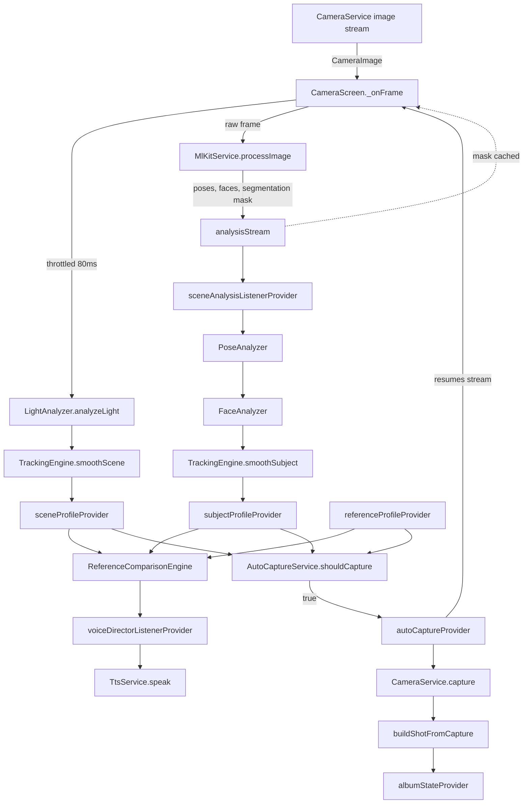

# Cuemera — Technical Documentation

This replaces the informal `PROJECT_STATUS.md` / `AI_SESSION_CONTEXT.md` handoff notes with a structured reference, based on a full read of all 53 `.dart` files + `pubspec.yaml` in the original session (no `test/`, `android/`, `ios/`, or `assets/` files were provided). **Updated after a follow-up session that applied fixes for every P0/P1 item and most of the hygiene backlog** — see `LIMITATIONS_AND_ROADMAP.md` for what's resolved vs. still outstanding.

Companion docs: [`FILE_REFERENCE.md`](./FILE_REFERENCE.md) · [`LIMITATIONS_AND_ROADMAP.md`](./LIMITATIONS_AND_ROADMAP.md) · [`APPENDIX.md`](./APPENDIX.md)

## 1. Project Overview

Cuemera is a Flutter app that acts as a real-time AI fashion photographer: the user supplies a reference photo, and the app compares the live camera feed against it — pose, expression, composition, lighting, background — speaking corrective cues via TTS and auto-capturing when the live shot converges on the reference. A 0–100 editorial score and per-category breakdown follow each capture.

**Target user:** someone taking a self-portrait/portrait who wants to match a specific reference look without a second person directing them.

**High-level flow:** Splash (camera permission, theme/ML Kit/MemoryService init) → Home (Shoot / Album / Settings) → Camera session (pick reference photo → live pose/face/scene analysis → voice coaching → auto/manual capture → score) → Album (browse captured shots, persisted across restarts).

**Stack:** Flutter + Riverpod (state, single DI path), Google ML Kit (pose/face/selfie-segmentation, on-device — live face detector runs with classification enabled, though `eyesOpen`/`expression` are currently disabled downstream, see below), `flutter_tts` (voice), `camera`, `image` + `palette_generator` (reference-photo pixel analysis), Hive (wired into `AlbumNotifier` for real cross-restart persistence), and (in progress) `flutter_gemma` running Gemma 3 270M on-device for coaching-phrase variety — see `SIGNAL_DISABLE_AND_AI_INTEGRATION_PLAN.md`.

## 2. Architecture Deep Dive

### Layers
- `core/` — theme, constants, cross-cutting services (camera, ML Kit wrapper, TTS, Hive-backed memory service, theme persistence, shared expression classifier, tracking engine).
- `features/<name>/{domain,providers,services,presentation}` — one folder per capability; Riverpod providers wire domain + services to presentation.
- `shared/widgets/` — presentational components reused across features.

### Feature map

| Feature folder | Responsibility |
|---|---|
| `splash` | camera permission request, theme/ML Kit/MemoryService bootstrap, routes to home |
| `home` | the home/menu screen (Shoot / Album / Settings) — renamed from `goal_selection`, a holdover from a deleted feature (`HomeScreen`, `HomeMenuCard`) |
| `reference_photo` | pick + analyze a reference photo into a `ReferenceProfile`; tolerance sliders; detection-threshold config |
| `scene_analysis` | per-frame pose/face/light analysis → `SubjectProfile` / `SceneProfile`, EMA smoothing |
| `voice_director` | compares live vs. reference, picks the single worst-deviating attribute (`ComparisonMath`-driven), speaks a phrase — the decision (attribute/direction/severity) is now decoupled from the phrase text (`CoachingDecision`); an on-device LLM is being wired in to vary the wording, still falling back to today's hand-authored phrase bank when unavailable — see `SIGNAL_DISABLE_AND_AI_INTEGRATION_PLAN.md` |
| `capture` | decides *when* to auto-capture, builds a `Shot`, shot-type selection |
| `editorial_score` | scores a `Shot` against the reference (0–100 overall + per-category breakdown) |
| `album` | Hive-backed persisted store of captured `Shot`s, browsing UI, "diversity" / "next shot" suggestions (now reachable via shot-type picker) |
| `camera_session` | the screen hosting the camera preview; wires all of the above together, including the adjustments/shot-type sheets |
| `settings` | dark-mode toggle only |

### Data flow — live session

The live `FaceDetector` (`ml_kit_service.dart`) runs with `enableClassification: true`, so ML Kit still computes `eyesOpen`/expression signals — but `FaceAnalyzer` now discards both before they reach `SubjectProfile` (`enableEyeAndExpressionSignals = false`, see `SIGNAL_DISABLE_AND_AI_INTEGRATION_PLAN.md`'s Track 1): the classified values were flipping constantly frame-to-frame with no hysteresis against ML Kit's raw probability noise. `facePitch`/`faceRoll`/`mouthOpenRatio`/`eyeOpenRatio` (the continuous ratio, not the bool) are unaffected. The live and reference-photo expression classifiers remain unified into a single shared function (`core/services/expression_classifier.dart`) for whenever this is re-enabled — both remain rule-based threshold ladders rather than a trained model (see `LIMITATIONS_AND_ROADMAP.md`, Model-driven upgrade).

`autoCaptureProvider` now resumes the image stream (`cameraService.startImageStream`) after every auto-capture, mirroring the manual-capture path — the previous "first auto-capture freezes the preview forever" bug is resolved.

### DI

`get_it`/`service_locator.dart` has been removed entirely. There is now a single DI path: Riverpod `Provider<T>`s (`cameraServiceProvider`, `mlKitServiceProvider`, `ttsServiceProvider`, `memoryServiceProvider`) construct and own every service. `memoryServiceProvider` is a `FutureProvider<MemoryService>` — it awaits `MemoryService.init()` (opening the two Hive boxes) before resolving, so any consumer awaiting `memoryServiceProvider.future` is guaranteed an initialized service.