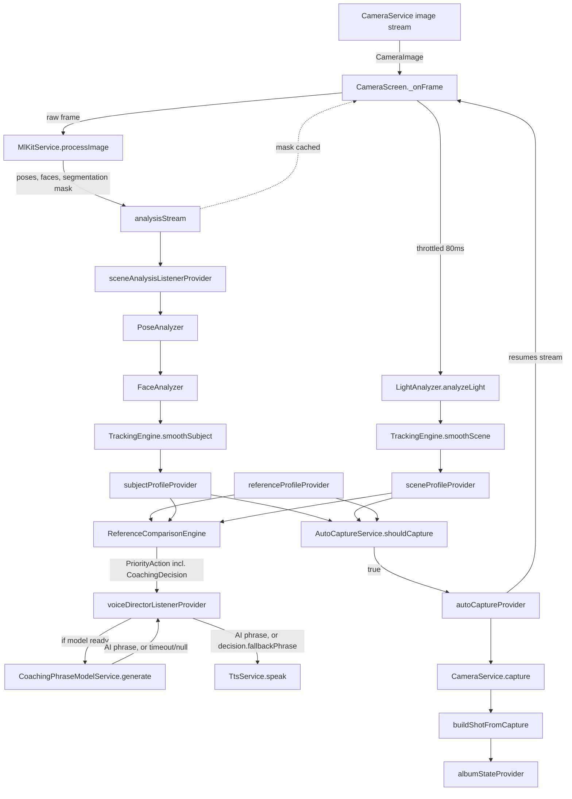

# Cuemera — Technical Documentation

This replaces the informal `PROJECT_STATUS.md` / `AI_SESSION_CONTEXT.md` handoff notes with a structured reference, based on a full read of all 53 `.dart` files + `pubspec.yaml` in the original session (no `test/`, `android/`, `ios/`, or `assets/` files were provided). Updated across several follow-up sessions: all P0/P1 hygiene items resolved, the `eyesOpen`/`expression` signal-disable (Track 1) shipped and tested, and an on-device AI phrase-generation layer (Track 2) is code-complete through Phase 2 but not yet active — see §4 below and `LIMITATIONS_AND_ROADMAP.md` for full detail.

Companion docs: [`FILE_REFERENCE.md`](./FILE_REFERENCE.md) · [`LIMITATIONS_AND_ROADMAP.md`](./LIMITATIONS_AND_ROADMAP.md) · [`APPENDIX.md`](./APPENDIX.md)

## 1. Project Overview

Cuemera is a Flutter app that acts as a real-time AI fashion photographer: the user supplies a reference photo, and the app compares the live camera feed against it — pose, expression, composition, lighting, background — speaking corrective cues via TTS and auto-capturing when the live shot converges on the reference. A 0–100 editorial score and per-category breakdown follow each capture.

**Target user:** someone taking a self-portrait/portrait who wants to match a specific reference look without a second person directing them.

**High-level flow:** Splash (camera permission, theme/ML Kit/MemoryService init) → Home (Shoot / Album / Settings) → Camera session (pick reference photo → live pose/face/scene analysis → voice coaching → auto/manual capture → score) → Album (browse captured shots, persisted across restarts).

**Stack:** Flutter + Riverpod (state, single DI path), Google ML Kit (pose/face/selfie-segmentation, on-device — live face detector runs with classification enabled, though `eyesOpen`/`expression` are currently disabled downstream, see §3), `flutter_tts` (voice), `camera`, `image` + `palette_generator` (reference-photo pixel analysis), Hive (wired into `AlbumNotifier` for real cross-restart persistence — see §5 for a maintenance note), and `flutter_gemma` running Gemma 3 270M on-device for coaching-phrase variety (code-complete, not yet active — see §4).

**Toolchain:** Dart SDK `^3.12.0` / Flutter `3.44+` (bumped from `^3.8.1` for `flutter_gemma`'s minimum requirement — needs an actual `flutter upgrade`, not just a `pubspec.yaml` edit).

## 2. Architecture Deep Dive

### Layers
- `core/` — theme, constants, cross-cutting services (camera, ML Kit wrapper, TTS, Hive-backed memory service, theme persistence, shared expression classifier, tracking engine).
- `features/<name>/{domain,providers,services,presentation}` — one folder per capability; Riverpod providers wire domain + services to presentation.
- `shared/widgets/` — presentational components reused across features.

### Feature map

| Feature folder | Responsibility |
|---|---|
| `splash` | camera permission request, theme/ML Kit/MemoryService bootstrap, routes to home |
| `home` | the home/menu screen (Shoot / Album / Settings) — renamed from `goal_selection`, a holdover from a deleted feature (`HomeScreen`, `HomeMenuCard`) |
| `reference_photo` | pick + analyze a reference photo into a `ReferenceProfile`; tolerance sliders; detection-threshold config |
| `scene_analysis` | per-frame pose/face/light analysis → `SubjectProfile` / `SceneProfile`, EMA smoothing |
| `voice_director` | compares live vs. reference, picks the single worst-deviating attribute (`ComparisonMath`-driven), speaks a phrase. The decision (attribute/direction/severity) is decoupled from the phrase text (`CoachingDecision`); an on-device LLM (Gemma 3 270M) is wired in to generate phrase variety with a fallback to the hand-authored phrase bank on timeout/failure — currently a no-op in practice since nothing yet triggers the model download. See §4. |
| `capture` | decides *when* to auto-capture, builds a `Shot`, shot-type selection |
| `editorial_score` | scores a `Shot` against the reference (0–100 overall + per-category breakdown) |
| `album` | Hive-backed persisted store of captured `Shot`s, browsing UI, "diversity" / "next shot" suggestions (now reachable via shot-type picker) |
| `camera_session` | the screen hosting the camera preview; wires all of the above together, including the adjustments/shot-type sheets |
| `settings` | dark-mode toggle only — no AI-coaching enable/disable control exists yet; see §4's open decision |

### Data flow — live session



`autoCaptureProvider` resumes the image stream (`cameraService.startImageStream`) after every auto-capture, mirroring the manual-capture path.

### DI

`get_it`/`service_locator.dart` has been removed entirely. There is now a single DI path: Riverpod `Provider<T>`s (`cameraServiceProvider`, `mlKitServiceProvider`, `ttsServiceProvider`, `memoryServiceProvider`, `coachingPhraseModelServiceProvider`) construct and own every service. `memoryServiceProvider` is a `FutureProvider<MemoryService>` — it awaits `MemoryService.init()` (opening the two Hive boxes) before resolving, so any consumer awaiting `memoryServiceProvider.future` is guaranteed an initialized service.

## 3. Signal Disable (Track 1) — done

`eyesOpen` (bool gate) and `expression` (classified label) were flipping constantly frame-to-frame with no hysteresis against ML Kit's raw probability noise, so both are now permanently `null`, gated behind `FaceAnalyzer.enableEyeAndExpressionSignals = false` (checked once, right before the two values are written to the returned `SubjectProfile`). `faceAngleXDegrees`/`faceAngleZDegrees`/`mouthOpenRatio`/`eyeOpenRatio` (the continuous ratio, not the bool) are untouched. `expression_classifier.dart` is still called internally, not deleted, so re-enabling is a one-line flag flip.

This required downstream fixes once the signal went permanently null: `auto_capture_service.dart` had a hard `eyesOpen != true` gate that would have silently blocked every capture forever (removed); `score_calculator.dart` needed an explicit neutral-`60` fallback for subject-side-missing-expression (added, replacing an accidental always-max-deviation score); `tracking_engine.dart` needed no change — `trackingProgress()` already required both sides non-null before scoring either attribute, so the permanent-null case cleanly drops out of the weighted average.

`flutter test` passing (150 tests) with this change in place. Full per-file detail in `FILE_REFERENCE.md`.

**Known open item from this track:** `_evaluateFaceRoll`'s left/right direction (`_faceRollDirectionIsMirrored` flag, currently `false`) hasn't been confirmed on a physical device — see `LIMITATIONS_AND_ROADMAP.md`.

## 4. AI Coaching Phrase Generation (Track 2) — code-complete through Phase 2, not yet active

**Goal:** `ReferenceComparisonEngine` picks from a fixed, hand-authored phrase bank, so the same deviation always produces byte-identical spoken text. Track 2 adds an on-device small LLM (Gemma 3 270M via `flutter_gemma`) to vary the wording, while keeping the phrase bank as a guaranteed fallback.

**Current state, phase by phase:**

- **Phase 0 (decouple decision from phrase) — done.** New `CoachingDecision` model (`attribute`/`direction`/`tier`/`normalizedSeverity`/`fallbackPhrase`/`targetExpression`) at `features/voice_director/models/coaching_decision.dart`, wired through `_AttributeEvaluation`/`PriorityAction`. Dedupe in `voiceDirectorListenerProvider` keys on `decision.dedupeKey` instead of phrase-string-equality.
- **Phase 1 (model integration, isolated) — code done, not device-verified.** `CoachingPhraseModelService` (`features/voice_director/services/`) wraps `litert-community/gemma-3-270m-it`'s `gemma3-270m-it-q8.task` mobile build (~304MB, gated on Hugging Face, downloaded on-demand via `.fromNetwork` rather than bundled in app assets). `ensureInstalled()`/`generate()` — `generate()` never throws, returns `null` on any failure. Token sourced via build-time `--dart-define=HF_TOKEN=...`. A smoke test exists at `integration_test/coaching_phrase_model_smoke_test.dart` (correct top-level location — it was initially misplaced under `test/`, where the `integration_test` plugin doesn't detect it) but has not been run:
  ```
  flutter test integration_test/coaching_phrase_model_smoke_test.dart \
    --dart-define=HF_TOKEN=<token> -d <device-id>
  ```
- **Phase 2 (wire into live path) — code done, functionally inert.** `voiceDirectorListenerProvider` calls `CoachingPhraseModelService.generate()` per debounced decision (3s timeout), falling back to `decision.fallbackPhrase` on timeout/`null`/not-ready/thrown. `coachingAiUnavailableProvider` trips after 3 consecutive failures (mirrors the existing `mlKitUnavailableProvider` pattern), so a device that can't run the model stops paying generation latency. **Nothing in the app currently calls `ensureInstalled()`** — so `phraseModel.isReady` is always `false`, and every decision still resolves to `decision.fallbackPhrase`, identical to pre-Track-2 behavior. This is the one open decision blocking real activation: where should that trigger live (a settings toggle, automatic on first reference-photo pick)? Not decided yet.
- **Phase 3 (measure and tune) — instrumentation only, no data.** `voice_providers.dart` logs every generation attempt via `debugPrint` (latency, attribute, success/fail — mirrors `CameraService.capture()`'s existing instrumentation pattern) and exposes `lastPhraseGenerationLatencyMs`/`lastPhraseGenerationSucceeded`. No real numbers exist yet; latency-vs-80ms-budget, phrase-quality, and model-size/quantization trade-offs all wait on the Phase 1 smoke test running and Phase 2 actually being triggered.

Full task-by-task detail, including everything considered and ruled out, lives in `LIMITATIONS_AND_ROADMAP.md`'s "Model-driven upgrade" section rather than duplicated here.

## 5. Known maintenance note

`hive`/`hive_flutter` are effectively unmaintained (`hive_flutter`'s last release predates this documentation by years) — surfaced when bumping the Dart SDK for `flutter_gemma`. Not confirmed broken against Dart 3.12, but `hive_ce` is the community-maintained successor if a conflict ever surfaces. See `LIMITATIONS_AND_ROADMAP.md` for the rest of the open backlog (product decisions and physical-device-testing items unrelated to Track 1/2).