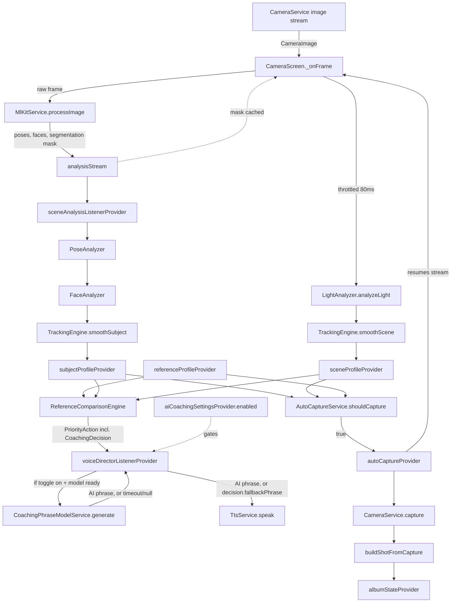

# Cuemera — Technical Documentation

This replaces the informal `PROJECT_STATUS.md` / `AI_SESSION_CONTEXT.md` handoff notes with a structured reference. Updated across several follow-up sessions: all P0/P1 hygiene items resolved, the `eyesOpen`/`expression` signal-disable (Track 1) shipped and tested, and the on-device AI phrase-generation layer (Track 2) is now **active** — device-verified end-to-end, gated behind a Settings toggle. See §4 below and `LIMITATIONS_AND_ROADMAP.md` for full detail.

Companion docs: [`FILE_REFERENCE.md`](./FILE_REFERENCE.md) · [`LIMITATIONS_AND_ROADMAP.md`](./LIMITATIONS_AND_ROADMAP.md)

`APPENDIX.md` has been merged into `LIMITATIONS_AND_ROADMAP.md` (the two had drifted into near-duplicates) and is now just a pointer — safe to delete once you've confirmed nothing external links to it.

## 1. Project Overview

Cuemera is a Flutter app that acts as a real-time AI fashion photographer: the user supplies a reference photo, and the app compares the live camera feed against it — pose, expression, composition, lighting, background — speaking corrective cues via TTS and auto-capturing when the live shot converges on the reference. A 0–100 editorial score and per-category breakdown follow each capture.

**Target user:** someone taking a self-portrait/portrait who wants to match a specific reference look without a second person directing them.

**High-level flow:** Splash (camera permission, theme/ML Kit/MemoryService init) → Home (Shoot / Album / Settings) → Camera session (pick reference photo → live pose/face/scene analysis → voice coaching → auto/manual capture → score) → Album (browse captured shots, persisted across restarts).

**Stack:** Flutter + Riverpod (state, single DI path), Google ML Kit (pose/face/selfie-segmentation, on-device — live face detector runs with classification enabled, though `eyesOpen`/`expression` are currently disabled downstream, see §3), `flutter_tts` (voice), `camera`, `image` + `palette_generator` (reference-photo pixel analysis), Hive (wired into `AlbumNotifier` for real cross-restart persistence, and now also into the AI-coaching toggle's persistence — see §5), and `flutter_gemma` running Gemma 3 270M on-device for coaching-phrase variety (**active** — see §4).

**Toolchain:** Dart SDK `^3.12.0` / Flutter `3.44.9`. Android side, bumped this session to satisfy `flutter_gemma`/`flutter_gemma_mediapipe`'s native requirements:
- Gradle wrapper: `8.14.3` (was `8.12`)
- Android Gradle Plugin (AGP): `8.11.1` (was `8.7.3` — the prior version couldn't satisfy `androidx.core:core-ktx:1.17.0`'s minimum AGP requirement, which failed `checkDebugAarMetadata`)
- Kotlin: `2.2.20` (was `2.1.0`)
- NDK: `28.2.13676358` (was `27.0.12077973` — `integration_test` requires this version specifically)

All four are set in `android/settings.gradle.kts` (AGP, Kotlin), `android/gradle/wrapper/gradle-wrapper.properties` (Gradle), and `android/app/build.gradle.kts` (NDK).

## 2. Architecture Deep Dive

### Layers
- `core/` — theme, constants, cross-cutting services (camera, ML Kit wrapper, TTS, Hive-backed memory service, theme persistence, shared expression classifier, tracking engine).
- `features/<name>/{domain,providers,services,presentation}` — one folder per capability; Riverpod providers wire domain + services to presentation.
- `shared/widgets/` — presentational components reused across features.

### Feature map

| Feature folder | Responsibility |
|---|---|
| `splash` | camera permission request, theme/ML Kit/MemoryService bootstrap, routes to home |
| `home` | the home/menu screen (Shoot / Album / Settings) — renamed from `goal_selection`, a holdover from a deleted feature (`HomeScreen`, `HomeMenuCard`) |
| `reference_photo` | pick + analyze a reference photo into a `ReferenceProfile`; tolerance sliders; detection-threshold config |
| `scene_analysis` | per-frame pose/face/light analysis → `SubjectProfile` / `SceneProfile`, EMA smoothing |
| `voice_director` | compares live vs. reference, picks the single worst-deviating attribute (`ComparisonMath`-driven), speaks a phrase. The decision (attribute/direction/severity) is decoupled from the phrase text (`CoachingDecision`); an on-device LLM (Gemma 3 270M) generates phrase variety with a fallback to the hand-authored phrase bank on timeout/failure — **now live**, gated behind the Settings toggle (`aiCoachingEnabledProvider`) rather than always-on. See §4. |
| `capture` | decides *when* to auto-capture, builds a `Shot`, shot-type selection |
| `editorial_score` | scores a `Shot` against the reference (0–100 overall + per-category breakdown) |
| `album` | Hive-backed persisted store of captured `Shot`s, browsing UI, "diversity" / "next shot" suggestions (now reachable via shot-type picker) |
| `camera_session` | the screen hosting the camera preview; wires all of the above together, including the adjustments/shot-type sheets |
| `settings` | dark-mode toggle, plus a new **AI Coaching Phrases** toggle (`features/settings/providers/ai_coaching_providers.dart`) that drives `CoachingPhraseModelService.ensureInstalled()` and persists via `MemoryService`'s habits box |

### Data flow — live session

`autoCaptureProvider` resumes the image stream (`cameraService.startImageStream`) after every auto-capture, mirroring the manual-capture path.

### DI

`get_it`/`service_locator.dart` has been removed entirely. There is now a single DI path: Riverpod `Provider<T>`s (`cameraServiceProvider`, `mlKitServiceProvider`, `ttsServiceProvider`, `memoryServiceProvider`, `coachingPhraseModelServiceProvider`) construct and own every service. `memoryServiceProvider` is a `FutureProvider<MemoryService>` — it awaits `MemoryService.init()` (opening the two Hive boxes) before resolving, so any consumer awaiting `memoryServiceProvider.future` is guaranteed an initialized service. `coachingPhraseModelServiceProvider` now returns `CoachingPhraseModelService?` (nullable) instead of asserting/crashing when `HF_TOKEN` isn't set at build time — see §4.

## 3. Signal Disable (Track 1) — done

`eyesOpen` (bool gate) and `expression` (classified label) were flipping constantly frame-to-frame with no hysteresis against ML Kit's raw probability noise, so both are now permanently `null`, gated behind `FaceAnalyzer.enableEyeAndExpressionSignals = false` (checked once, right before the two values are written to the returned `SubjectProfile`). `faceAngleXDegrees`/`faceAngleZDegrees`/`mouthOpenRatio`/`eyeOpenRatio` (the continuous ratio, not the bool) are untouched. `expression_classifier.dart` is still called internally, not deleted, so re-enabling is a one-line flag flip.

This required downstream fixes once the signal went permanently null: `auto_capture_service.dart` had a hard `eyesOpen != true` gate that would have silently blocked every capture forever (removed); `score_calculator.dart` needed an explicit neutral-`60` fallback for subject-side-missing-expression (added, replacing an accidental always-max-deviation score); `tracking_engine.dart` needed no change — `trackingProgress()` already required both sides non-null before scoring either attribute, so the permanent-null case cleanly drops out of the weighted average.

`flutter test` passing (150 tests) with this change in place. Full per-file detail in `FILE_REFERENCE.md`.

**Known open item from this track:** `_evaluateFaceRoll`'s left/right direction (`_faceRollDirectionIsMirrored` flag, currently `false`) hasn't been confirmed on a physical device — see `LIMITATIONS_AND_ROADMAP.md`.

## 4. AI Coaching Phrase Generation (Track 2) — active

**Goal:** `ReferenceComparisonEngine` picks from a fixed, hand-authored phrase bank, so the same deviation always produces byte-identical spoken text. Track 2 adds an on-device small LLM (Gemma 3 270M via `flutter_gemma`) to vary the wording, while keeping the phrase bank as a guaranteed fallback.

**Current state:**

- **Phase 0 (decouple decision from phrase) — done.** `CoachingDecision` model (`attribute`/`direction`/`tier`/`normalizedSeverity`/`fallbackPhrase`/`targetExpression`) at `features/voice_director/models/coaching_decision.dart`, wired through `_AttributeEvaluation`/`PriorityAction`. Dedupe in `voiceDirectorListenerProvider` keys on `decision.dedupeKey` instead of phrase-string-equality.
- **Phase 1 (model integration) — done, device-verified.** `CoachingPhraseModelService` wraps `litert-community/gemma-3-270m-it`'s `gemma3-270m-it-q8.task` mobile build (~304MB, gated on Hugging Face — the accessing account must accept the Gemma license on the model page, separately from having a valid token). The integration smoke test (`integration_test/coaching_phrase_model_smoke_test.dart`) has now been run on a physical device and **all 5 sample decisions passed** — install completed, and `generate()` returned non-null, non-empty phrases for each (e.g. the `hue`/strong-severity case returned in 2200ms). Two real bugs were found and fixed in this pass:
  - `_ensurePluginInitialized()` fired `FlutterGemma.initialize(...)` without awaiting it, then immediately called `install()` — a race condition where `install()` could run before plugin registration finished, throwing `Bad state: FlutterGemma not initialized!`. Fixed by making the method `async` and awaiting the call.
  - `coachingPhraseModelServiceProvider` used `assert(_huggingFaceToken.isNotEmpty, ...)`, which crashes any debug build missing `--dart-define=HF_TOKEN=...` — including builds where AI coaching is meant to be off entirely. Fixed: the provider now returns `CoachingPhraseModelService?` (null when no token), and callers (`voice_providers.dart`, the new settings toggle) treat null as "AI coaching unavailable on this build" rather than crashing.
- **Phase 2 (wire into live path + user control) — done.** `voiceDirectorListenerProvider` calls `CoachingPhraseModelService.generate()` per debounced decision (3s timeout), falling back to `decision.fallbackPhrase` on timeout/`null`/not-ready/thrown. `coachingAiUnavailableProvider` trips after 3 consecutive failures. **New this session:** a Settings toggle ("AI Coaching Phrases", `features/settings/providers/ai_coaching_providers.dart` + updated `settings_screen.dart`) now controls activation — `ensureInstalled()` only runs when the user turns the toggle on, its state persists via `MemoryService`'s habits box, and `voiceDirectorListenerProvider` gates on `aiCoachingSettingsProvider.enabled` in addition to `phraseModel?.isReady`. This was a deliberate choice over auto-triggering on first reference-photo pick, since `ensureInstalled()` silently pulls ~304MB — a user should opt into that, not eat it unknowingly on mobile data.
- **Phase 3 (measure and tune) — started, needs more data.** `voice_providers.dart` logs every generation attempt via `debugPrint` (latency, attribute, success/fail) and exposes `lastPhraseGenerationLatencyMs`/`lastPhraseGenerationSucceeded`. The smoke test run gave one confirmed data point (`hue`, strong severity: 2200ms, well under both the 3s generation timeout and — more importantly — nowhere near the 80ms/frame throttle budget, though that budget applies to the frame-analysis loop, not phrase generation, which runs off the debounced coaching path). Latency for the other 4 sample decisions, plus a real phrase-quality/naturalness pass and confirmation that `gemma-3-270m-it-q8`'s quantization is the right choice, still need a full run's worth of data — capture the complete `flutter test` output next time to fill this in properly.

Full task-by-task detail lives in `LIMITATIONS_AND_ROADMAP.md`.

## 5. Known maintenance note

`hive`/`hive_flutter` are effectively unmaintained (`hive_flutter`'s last release predates this documentation by years) — surfaced when bumping the Dart SDK for `flutter_gemma`. Not confirmed broken against Dart 3.12, but `hive_ce` is the community-maintained successor if a conflict ever surfaces. See `LIMITATIONS_AND_ROADMAP.md` for the rest of the open backlog (product decisions and physical-device-testing items unrelated to Track 1/2).