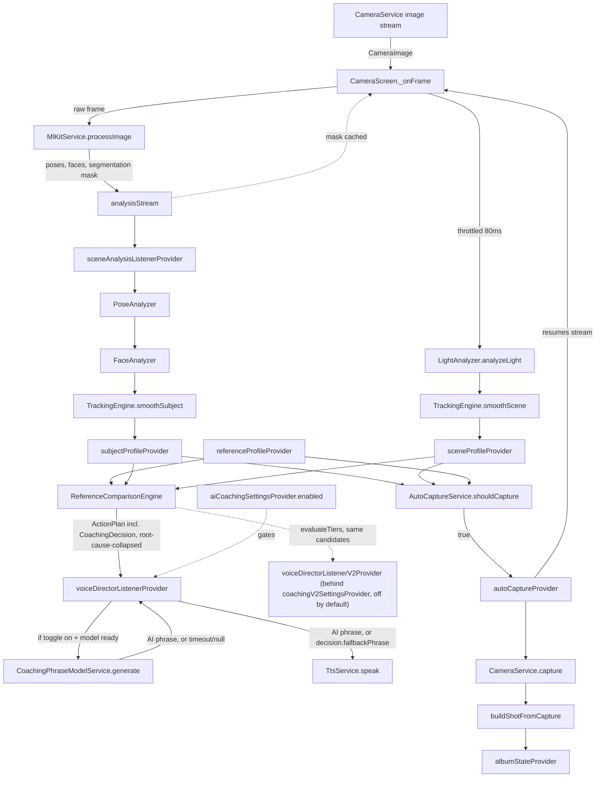

# Cuemera — Technical Documentation

This replaces the informal `PROJECT_STATUS.md` / `AI_SESSION_CONTEXT.md` handoff notes with a structured reference. Updated across several follow-up sessions: all P0/P1 hygiene items resolved, the `eyesOpen`/`expression` signal-disable (Track 1) shipped and tested, and the on-device AI phrase-generation layer (Track 2) is now **active** — device-verified end-to-end, gated behind a Settings toggle. See §4 below and `LIMITATIONS_AND_ROADMAP.md` for full detail.

**A sixth session fixed four device-confirmed bugs** (crash and correctness, not just hygiene): a front/back-camera rotation mismatch in `MlKitService` that made `shoulderAngle`/`faceAngle` coaching fail on the front camera regardless of actual pose (§3a); a native crash (`SIGABRT`, uncatchable from Dart) in Track 2's coaching-phrase generation caused by `maxTokens` being too low for the prompt (§4); an EXIF-orientation mismatch in `ReferenceImageAnalyzer` that made the pose-skeleton overlay render at the wrong scale/position on some reference photos (§6); and an R8/minify build failure specific to `flutter_gemma_mediapipe`'s release build (§6). Also added: a short TTS confirmation ("Photo captured.") after a successful manual capture. `APPENDIX.md` is now redundant — see the note at the end of this doc.

**A seventh session added a second TTS engine, `sherpa_onnx` (VITS/Piper), as the primary voice — with the existing `flutter_tts` kept as an automatic fallback.** See §8 below. **Status: in progress, not yet device-verified** — the asset wiring is still being finalized (the `espeak-ng-data` subdirectory listing for `pubspec.yaml` hadn't been supplied as of this writing), so nothing in §8 should be read as confirmed working end-to-end yet.

**An eleventh session unified pose-landmark trust filtering across the reference-photo and live-camera paths**, implementing all three phases of the standalone `REFERENCE_TRUST_FILTER_SOLUTION.md` handoff doc, applying the tenth session's Bug 5 likelihood gate to the live side (`pose_analyzer.dart`) for the first time, and finding/fixing a real bug in the new Phase 2 code via an actual test screenshot. See §12 below.

**A twelfth session found that the eleventh session's own painter fix was itself incomplete, rewrote Phase 2's crop-redetect logic from recovery-only to full evidence-based reconciliation (with veto power over the original detector), enabled `PoseDetectionModel.accurate` for the reference-photo pose detector, finished `sherpa_onnx`'s asset wiring in `pubspec.yaml`, and opened (not yet closed) an investigation into why Track 2's AI-coaching phrases still aren't being heard despite a valid `HF_TOKEN`.** See §13 below.

**A thirteenth session closed the twelfth session's AI-coaching investigation, then implemented a standalone architecture audit's migration plan (steps 1–4 and 8–10 of 11) end to end, in the process finding and fixing two more device-affecting bugs the audit itself didn't know to look for.** The AI-coaching phrases mystery: `ensureInstalled()`'s call site was never missing — it lives in `ai_coaching_providers.dart`'s `_install()`, the one file the twelfth session's investigation never got to review. The real cause was that `AiCoachingSettings.aiUnavailable` (set after 3 consecutive `generate()` failures) was tracked but never surfaced anywhere in `settings_screen.dart` — a user could be permanently stuck on fallback phrases with the toggle still showing "on" and no visible way to recover short of guessing to flip it off and back on. `CoachingDecision` gained real `confidence`/`controllability` fields (populated from on-device landmark trust for the five pose-derived attributes); `reference_comparison_engine.dart` now root-cause-collapses correlated pose/face attributes before picking what to say; `pose_analyzer.dart` (the live-camera path) turned out to never have computed `shoulderBalanceRatio`/`shoulderSpanRatio`/`bodyYawEstimate` at all, independent of and deeper than a similar-sounding bug fixed back in the fourth session — three of ten pose/face coaching evaluators were permanently dead on-device until this session; and a new, flag-gated, parallel coaching listener (`voice_providers_v2.dart`) built on a proper observe→instruct→wait→reobserve state machine now exists alongside the original, off by default pending device soak time. See §14 below for the full account.

**A fourteenth session finished the architecture audit's migration plan end to end (the last three gaps §14 left open: steps 5–7's LLM validation/model-recovery wiring, and both remaining `EligibilityContext` stubs), plus fixed four bugs the audit itself never had the files to find (`PoseLandmarkGate`'s silent `maskSignal` footgun, `estimateSymmetry` silently re-measuring shoulder tilt in two files, a dropped mid-utterance instruction, and unbounded LLM-generation cadence).** `_evaluateFaceYaw` — flagged as missing since the eighth session — now exists too, using a signal (`faceAngleDegrees` = ML Kit's `headEulerAngleY`) that had been captured and stored since that same session but never read by anything. See §15 below.

**A fifteenth session took the fourteenth session's work onto a physical device for the first time, via a live debugging thread rather than a scheduled review — found and fixed a Flutter-SDK breaking change that had silently disabled `sherpa_onnx` since it was added in the seventh session, a genuine race condition in when `sherpa_onnx` initializes relative to first use, a bare `catch` that had been swallowing `sherpa_onnx`'s real failure reason since the same session, a model-download UX problem masquerading as a hang, and two more circular-angle bugs (this project's fourth recurrence of the same bug class, now in two files — `tracking_engine.dart` and `auto_capture_service.dart` — that had never been reviewed before this session) that were silently making auto-capture fire on far less than a full-body pose match.** See §16 below.

Companion docs: [`FILE_REFERENCE.md`](./FILE_REFERENCE.md) · [`LIMITATIONS_AND_ROADMAP.md`](./LIMITATIONS_AND_ROADMAP.md)

## 1. Project Overview

Cuemera is a Flutter app that acts as a real-time AI fashion photographer: the user supplies a reference photo, and the app compares the live camera feed against it — pose, expression, composition, lighting, background — speaking corrective cues via TTS and auto-capturing when the live shot converges on the reference. A 0–100 editorial score and per-category breakdown follow each capture.

**Target user:** someone taking a self-portrait/portrait who wants to match a specific reference look without a second person directing them.

**High-level flow:** Splash (camera permission, theme/ML Kit/MemoryService init) → Home (Shoot / Album / Settings) → Camera session (pick reference photo → live pose/face/scene analysis → voice coaching → auto/manual capture → score) → Album (browse captured shots, persisted across restarts).

**Stack:** Flutter + Riverpod (state, single DI path), Google ML Kit (pose/face/selfie-segmentation, on-device — the live `FaceDetector` actually has `enableClassification: false`, contradicting earlier notes here that said classification was enabled; `eyesOpen`/`expression` are `null` both because of this and because of Track 1's explicit signal-disable flag, see §3 and §7), a two-tier TTS setup — `sherpa_onnx` (offline VITS/Piper, primary, in progress — see §8) with `flutter_tts` kept as an automatic fallback, plus a short "Photo captured." confirmation after manual capture, `camera`, `image` + `palette_generator` (reference-photo pixel analysis, now with EXIF orientation correction — see §6), Hive (wired into `AlbumNotifier` for real cross-restart persistence, and now also into the AI-coaching toggle's persistence — see §5), and `flutter_gemma` running Gemma 3 270M on-device for coaching-phrase variety (**active** — see §4).

**Toolchain:** Dart SDK `^3.12.0` / Flutter `3.44.9`. Android side, bumped this session to satisfy `flutter_gemma`/`flutter_gemma_mediapipe`'s native requirements:
- Gradle wrapper: `8.14.3` (was `8.12`)
- Android Gradle Plugin (AGP): `8.11.1` (was `8.7.3` — the prior version couldn't satisfy `androidx.core:core-ktx:1.17.0`'s minimum AGP requirement, which failed `checkDebugAarMetadata`)
- Kotlin: `2.2.20` (was `2.1.0`)
- NDK: `28.2.13676358` (was `27.0.12077973` — `integration_test` requires this version specifically)

All four are set in `android/settings.gradle.kts` (AGP, Kotlin), `android/gradle/wrapper/gradle-wrapper.properties` (Gradle), and `android/app/build.gradle.kts` (NDK).

## 2. Architecture Deep Dive

### Layers
- `core/` — theme, constants, cross-cutting services (camera, ML Kit wrapper, TTS, Hive-backed memory service, theme persistence, shared expression classifier, tracking engine).
- `features/<n>/{domain,providers,services,presentation}` — one folder per capability; Riverpod providers wire domain + services to presentation.
- `shared/widgets/` — presentational components reused across features.

### Feature map

| Feature folder | Responsibility |
|---|---|
| `splash` | camera permission request, theme/ML Kit/MemoryService bootstrap, routes to home |
| `home` | the home/menu screen (Shoot / Album / Settings) — renamed from `goal_selection`, a holdover from a deleted feature (`HomeScreen`, `HomeMenuCard`) |
| `reference_photo` | pick + analyze a reference photo into a `ReferenceProfile`; tolerance sliders; detection-threshold config |
| `scene_analysis` | per-frame pose/face/light analysis → `SubjectProfile` / `SceneProfile`, EMA smoothing |
| `voice_director` | compares live vs. reference, picks the single worst-deviating attribute (`ComparisonMath`-driven), speaks a phrase. The decision (attribute/direction/severity/confidence/controllability) is decoupled from the phrase text (`CoachingDecision`); an on-device LLM (Gemma 3 270M) generates phrase variety, validated by `llm_output_validator.dart` before it's ever spoken, with a fallback to the hand-authored phrase bank on a failed validation check, timeout, or failure — gated behind the Settings toggle (`aiCoachingSettingsProvider`) rather than always-on, and now confidence-gated (`ConfidenceFloors.eligibleToSpeak`) on both listeners. Two parallel listeners now exist: the original listener (`voiceDirectorListenerProvider` — no longer drops an instruction that arrives mid-utterance, queues it instead) and a state-machine-driven one (`voiceDirectorListenerV2Provider`, behind its own experimental flag, off by default, with no stubbed `EligibilityContext` inputs left). `ModelLifecycleManager` is the shared source of truth for AI availability across both, with automatic capped-backoff recovery. See §4, §14, §15. |
| `capture` | decides *when* to auto-capture, builds a `Shot`, shot-type selection |
| `editorial_score` | scores a `Shot` against the reference (0–100 overall + per-category breakdown) |
| `album` | Hive-backed persisted store of captured `Shot`s, browsing UI, "diversity" / "next shot" suggestions (now reachable via shot-type picker) |
| `camera_session` | the screen hosting the camera preview; wires all of the above together, including the adjustments/shot-type sheets |
| `settings` | dark-mode toggle, plus a new **AI Coaching Phrases** toggle (`features/settings/providers/ai_coaching_providers.dart`) that drives `CoachingPhraseModelService.ensureInstalled()` and persists via `MemoryService`'s habits box |

### Data flow — live session

`autoCaptureProvider` resumes the image stream (`cameraService.startImageStream`) after every auto-capture, mirroring the manual-capture path.

### DI

`get_it`/`service_locator.dart` has been removed entirely. There is now a single DI path: Riverpod `Provider<T>`s (`cameraServiceProvider`, `mlKitServiceProvider`, `ttsServiceProvider`, `memoryServiceProvider`, `coachingPhraseModelServiceProvider`) construct and own every service. `memoryServiceProvider` is a `FutureProvider<MemoryService>` — it awaits `MemoryService.init()` (opening the two Hive boxes) before resolving, so any consumer awaiting `memoryServiceProvider.future` is guaranteed an initialized service. `coachingPhraseModelServiceProvider` now returns `CoachingPhraseModelService?` (nullable) instead of asserting/crashing when `HF_TOKEN` isn't set at build time — see §4.

## 3. Signal Disable (Track 1) — done

`eyesOpen` (bool gate) and `expression` (classified label) were flipping constantly frame-to-frame with no hysteresis against ML Kit's raw probability noise, so both are now permanently `null`, gated behind `FaceAnalyzer.enableEyeAndExpressionSignals = false` (checked once, right before the two values are written to the returned `SubjectProfile`). `faceAngleXDegrees`/`faceAngleZDegrees`/`mouthOpenRatio`/`eyeOpenRatio` (the continuous ratio, not the bool) are untouched. `expression_classifier.dart` is still called internally, not deleted, so re-enabling is a one-line flag flip.

This required downstream fixes once the signal went permanently null: `auto_capture_service.dart` had a hard `eyesOpen != true` gate that would have silently blocked every capture forever (removed); `score_calculator.dart` needed an explicit neutral-`60` fallback for subject-side-missing-expression (added, replacing an accidental always-max-deviation score); `tracking_engine.dart` needed no change — `trackingProgress()` already required both sides non-null before scoring either attribute, so the permanent-null case cleanly drops out of the weighted average.

`flutter test` passing (150 tests) with this change in place. Full per-file detail in `FILE_REFERENCE.md`.

**Known open item from this track:** `_evaluateFaceRoll`'s left/right direction (`_faceRollDirectionIsMirrored` flag, currently `false`) hasn't been confirmed on a physical device — see `LIMITATIONS_AND_ROADMAP.md`.

## 3a. Front/back camera rotation bug (sixth session) — fixed, needs device re-confirmation

**Symptom:** on the front (selfie) camera, `shoulderAngle` and `faceAngle` coaching read `FAIL` in the debug overlay even when the subject's pose visually matched the reference. Root cause was two-layered:

- `camera_screen.dart`'s `_onFrame` computed `InputImageRotation` itself using `(360 - sensorOrientation) % 360` for the front camera and `sensorOrientation` for the back camera — a formula that ignores device orientation entirely and doesn't match ML Kit's documented rotation-compensation convention (front: `sensorOrientation + deviceRotation`; back: `sensorOrientation - deviceRotation`, both mod 360).
- `MlKitService.processImage(...)` accepted a `CameraDescription description` parameter that was never actually used — the caller's (wrong) rotation was trusted as-is.

**Fix:** rotation computation moved entirely into `MlKitService`. `processImage(image, description, deviceOrientation)` now takes the raw `CameraDescription` and `DeviceOrientation` instead of a pre-computed rotation, and a new `rotationFor(description, deviceOrientation)` method applies the correct lens-direction-specific formula. `camera_screen.dart`'s `_onFrame` now just passes `controller.value.deviceOrientation` through and no longer computes rotation itself.

**Status:** code-complete, not yet re-confirmed on a physical device after the fix (the original symptom was observed via the debug overlay in a screenshot, not a formal test run) — see `LIMITATIONS_AND_ROADMAP.md` §1.

## 4. AI Coaching Phrase Generation (Track 2) — active

**Goal:** `ReferenceComparisonEngine` picks from a fixed, hand-authored phrase bank, so the same deviation always produces byte-identical spoken text. Track 2 adds an on-device small LLM (Gemma 3 270M via `flutter_gemma`) to vary the wording, while keeping the phrase bank as a guaranteed fallback.

**Current state:**

- **Phase 0 (decouple decision from phrase) — done.** `CoachingDecision` model (`attribute`/`direction`/`tier`/`normalizedSeverity`/`fallbackPhrase`/`confidence`/`controllability`/`targetExpression`) at `features/voice_director/models/coaching_decision.dart`, wired through `_AttributeEvaluation`/`ActionPlan` (renamed from `PriorityAction` in the thirteenth session — `priority_engine.dart` is retired, see §14). Dedupe in `voiceDirectorListenerProvider` keys on `decision.dedupeKey` instead of phrase-string-equality.
- **Phase 1 (model integration) — done, device-verified.** `CoachingPhraseModelService` wraps `litert-community/gemma-3-270m-it`'s `gemma3-270m-it-q8.task` mobile build (~304MB, gated on Hugging Face — the accessing account must accept the Gemma license on the model page, separately from having a valid token). The integration smoke test (`integration_test/coaching_phrase_model_smoke_test.dart`) has now been run on a physical device and **all 5 sample decisions passed** — install completed, and `generate()` returned non-null, non-empty phrases for each (e.g. the `hue`/strong-severity case returned in 2200ms). Two real bugs were found and fixed in this pass:
  - `_ensurePluginInitialized()` fired `FlutterGemma.initialize(...)` without awaiting it, then immediately called `install()` — a race condition where `install()` could run before plugin registration finished, throwing `Bad state: FlutterGemma not initialized!`. Fixed by making the method `async` and awaiting the call.
  - `coachingPhraseModelServiceProvider` used `assert(_huggingFaceToken.isNotEmpty, ...)`, which crashes any debug build missing `--dart-define=HF_TOKEN=...` — including builds where AI coaching is meant to be off entirely. Fixed: the provider now returns `CoachingPhraseModelService?` (null when no token), and callers (`voice_providers.dart`, the new settings toggle) treat null as "AI coaching unavailable on this build" rather than crashing.
  - **Sixth session, device crash log:** `FlutterGemma.getActiveModel(maxTokens: 128)` set `maxTokens` too low — a real coaching prompt reached 185 tokens on its own, already over the limit before any output token was generated. This aborted the native LLM inference process (`JNI DETECTED ERROR`, `SIGABRT`) — a crash uncatchable from Dart, since it happens below the FFI boundary, so `voiceDirectorListenerProvider`'s `try`/`catch`/`timeout` around `generate()` never got a chance to run. Fixed by raising `maxTokens` to `512`. **Not yet hardened further:** there's still no explicit prompt-length cap in `_buildPrompt()`, so a longer prompt in the future (e.g. from a new `CoachingAttribute` or a longer `fallbackPhrase`) could hit the same class of bug again — see `LIMITATIONS_AND_ROADMAP.md` §3.
- **Phase 2 (wire into live path + user control) — done.** `voiceDirectorListenerProvider` calls `CoachingPhraseModelService.generate()` per debounced decision (3s timeout), falling back to `decision.fallbackPhrase` on timeout/`null`/not-ready/thrown. `coachingAiUnavailableProvider` trips after 3 consecutive failures. **New this session:** a Settings toggle ("AI Coaching Phrases", `features/settings/providers/ai_coaching_providers.dart` + updated `settings_screen.dart`) now controls activation — `ensureInstalled()` only runs when the user turns the toggle on, its state persists via `MemoryService`'s habits box, and `voiceDirectorListenerProvider` gates on `aiCoachingSettingsProvider.enabled` in addition to `phraseModel?.isReady`. This was a deliberate choice over auto-triggering on first reference-photo pick, since `ensureInstalled()` silently pulls ~304MB — a user should opt into that, not eat it unknowingly on mobile data.
- **Phase 3 (measure and tune) — started, needs more data.** `voice_providers.dart` logs every generation attempt via `debugPrint` (latency, attribute, success/fail) and exposes `lastPhraseGenerationLatencyMs`/`lastPhraseGenerationSucceeded`. The smoke test run gave one confirmed data point (`hue`, strong severity: 2200ms, well under both the 3s generation timeout and — more importantly — nowhere near the 80ms/frame throttle budget, though that budget applies to the frame-analysis loop, not phrase generation, which runs off the debounced coaching path). Latency for the other 4 sample decisions, plus a real phrase-quality/naturalness pass and confirmation that `gemma-3-270m-it-q8`'s quantization is the right choice, still need a full run's worth of data — capture the complete `flutter test` output next time to fill this in properly.
- **Phase 4 (confidence-aware, root-cause-collapsed decisions) — done, thirteenth session, from a standalone architecture audit's migration plan.** `CoachingDecision` gained required `confidence`/`controllability` fields — every evaluator in `reference_comparison_engine.dart` now supplies both. Real confidence (from `core/pose/landmark_trust_model.dart`'s per-landmark trust, via `core/pose/landmark_gate.dart`) is wired for the five pose-derived attributes (`shoulderAngle`, `shoulderBalance`, `shoulderSpan`, `bodyYaw`, `bodyRatio`); the remaining eleven attributes (face/expression/composition/lighting) use an explicit, commented `1.0` placeholder pending a wired signal. `reference_comparison_engine.dart` now root-cause-collapses correlated pose/face attributes (torso-rotation-or-lean, head-orientation, facial-expression clusters — `root_cause_engine.dart`) before picking the worst tier via `action_plan.dart`'s severity-aware, confidence-weighted `pickAcrossTiers()`, replacing the flat `_pickWorst`/tier-priority logic Phase 0–3 shipped with. See §14 for the full account, including a critical bug found in `pose_analyzer.dart` along the way (three pose/face attributes were structurally unreachable on the live path, independent of this confidence work).

**Resolved (thirteenth session):** the AI-coaching investigation opened in the twelfth session is closed. `ensureInstalled()`'s call site was never missing — it's in `ai_coaching_providers.dart`'s `_install()` (called from `_loadPersisted()` at startup and from `setEnabled(true)`), the one file the twelfth session's review never reached. The real, confirmed cause was different: `AiCoachingSettings.aiUnavailable` (flipped after 3 consecutive `generate()` timeouts — see the tenth session's Bug 4) was tracked in state but never displayed anywhere in `settings_screen.dart`. A user could have the toggle showing "on," no error text, and still be permanently stuck on fallback phrases with no visible way to recover. Fixed: `settings_screen.dart` now shows a warning + a "Retry" action (re-invokes `setEnabled(true)`, which resets `coachingAiUnavailableProvider` and re-verifies the model) whenever `enabled && aiUnavailable && !isInstalling`. See §14.

Full task-by-task detail lives in `LIMITATIONS_AND_ROADMAP.md`.

## 5. Known maintenance note

`hive`/`hive_flutter` are effectively unmaintained (`hive_flutter`'s last release predates this documentation by years) — surfaced when bumping the Dart SDK for `flutter_gemma`. Not confirmed broken against Dart 3.12, but `hive_ce` is the community-maintained successor if a conflict ever surfaces.

## 6. Sixth session — EXIF orientation bug and Android release build fix

**Reference photo pose overlay rendering wrong (fixed):** `ReferenceImageAnalyzer._decodeImageFile` used `img.decodeImage(bytes)` to get `imageWidth`/`imageHeight` for `ReferenceProfile`, but that call reads raw sensor-orientation pixels and does **not** apply the photo's EXIF orientation tag. Meanwhile, the same analyzer's pose/face detection uses `InputImage.fromFilePath(imagePath)`, which **does** apply EXIF orientation. On an EXIF-rotated photo, this meant `imageWidth`/`imageHeight` (used by `ReferenceAnalysisPainter` to scale landmark points onto the preview canvas) were in a different coordinate space than the landmarks themselves — correct landmark coordinates got mapped onto the wrong canvas dimensions, producing skeleton lines that ran off toward unrelated parts of the photo. Fixed by calling `img.bakeOrientation()` on the decoded image before reading its dimensions.

**Android release build failing at R8/minify (fixed):** `flutter build apk`/`appbundle` in release mode failed at `:app:minifyReleaseWithR8` with `Missing class com.google.mediapipe.proto.CalculatorProfileProto$CalculatorProfile` and a second `GraphTemplateProto$CalculatorGraphTemplate` — two MediaPipe-internal profiling classes R8 couldn't resolve, pulled in transitively by `flutter_gemma_mediapipe`. `android/app/build.gradle.kts`'s `release` block had no `proguardFiles(...)` at all, so no keep/dontwarn rules were ever applied regardless of what was in `proguard-rules.pro`. Fixed by adding `proguardFiles(getDefaultProguardFile("proguard-android-optimize.txt"), "proguard-rules.pro")` to the `release` block, and creating `android/app/proguard-rules.pro` with the two `-dontwarn` lines Gradle's own generated `missing_rules.txt` specified. A release APK now builds successfully (confirmed: `app-release.apk`, ~230MB — see `LIMITATIONS_AND_ROADMAP.md` §3 re: shrinking this, e.g. via `--split-per-abi`).

## 7. Rendering: Impeller regression on at least one Android device

On one test device (model "7 ZS67"), the default Impeller renderer produced visibly worse frame pacing than Skia (`--no-enable-impeller`) — confirmed by comparing `--profile` runs with and without the flag. This matches several known, currently-open upstream issues (`flutter/flutter` #153186, #169423, #183510) describing Impeller performance regressions on specific Android GPU/driver combinations, not something specific to this codebase. See `LIMITATIONS_AND_ROADMAP.md` §1 for the recommended mitigation (disabling Impeller via `AndroidManifest.xml`) and its status.

## 8. Seventh session — sherpa_onnx (VITS) as primary TTS, in progress

**Goal:** `flutter_tts` (system TTS) has no control over intonation/emphasis. Added `sherpa_onnx`'s offline `OfflineTts` (VITS/Piper engine) as a second, primary voice, with `flutter_tts` kept as an automatic fallback for when the model isn't ready or a generation call throws — mirroring the existing AI-coaching-phrase-or-fallback pattern already used for Gemma.

**New files:**
- `core/services/sherpa_tts_service.dart` — wraps `sherpa_onnx.OfflineTts`. On `init()`, extracts the VITS model's asset files (bundled under `assets/models/vits-en/`) to a writable app-support directory on first run (the native lib needs real file paths, not Flutter asset-bundle keys), reading `AssetManifest.json` to discover exactly which files were declared. `speak(phrase, {emphasis})` maps a `TtsEmphasis` (`mild`/`moderate`/`strong`) to both `speed` (1.0 → 0.88, slower = more weight) and `OfflineTtsGenerationConfig.silenceScale` (0.2 → 0.45, longer pause = more dramatic), plus appends a trailing `!` for `strong` if the phrase doesn't already end with punctuation implying one — this is the practical ceiling of "emphasis" control this model exposes; there's no true prosody/SSML parameter. Output goes through `sherpa_onnx.writeWave()` to a temp WAV file, played via `audioplayers`' `AudioPlayer.play(DeviceFileSource(...))`, since `GeneratedAudio` only holds raw PCM samples and has no playback of its own.
- `core/services/app_tts_service.dart` — thin wrapper (`speak()`/`stop()`) that tries `SherpaTtsService` first, falls back to the existing `TtsService` (flutter_tts) on any failure or when `!isReady`. Call sites (`voice_providers.dart`, `camera_screen.dart`) only know about this wrapper, not the fallback logic itself.

**Updated files:**
- `voice_providers.dart` — switched from `ttsServiceProvider` to `appTtsServiceProvider`; added `emphasisFor(severityBand)` mapping `CoachingDecision.severityBand` to `TtsEmphasis` by string-matching `.name` (`'strong'`/`'moderate'`/else `mild`). **Left intentionally untyped** (no `SeverityBand` type annotation) — the actual type/enum name in `coaching_decision.dart` wasn't confirmed at the time this was written, so a concrete type couldn't be assumed without risking another wrong-guess compile error (see `LIMITATIONS_AND_ROADMAP.md` §2 for the follow-up needed).
- `camera_screen.dart` — the "Photo captured." confirmation now goes through `appTtsServiceProvider` instead of calling `TtsService` directly.
- `pubspec.yaml` — added `sherpa_onnx`/`audioplayers`. **Two structural bugs found and fixed in this file, unrelated to sherpa_onnx itself but blocking it:** a stray top-level `assets:` key (Flutter only reads `assets:` when nested under the `flutter:` key — this one was silently ignored, so *no* assets, including the pre-existing `assets/images/`, were ever actually being bundled), and `flutter_launcher_icons.image_path` had `assets/models/vits-en/` mistakenly appended to what should be a single icon-file path.

**Model chosen:** `vits-piper-en_US-lessac-medium` (single-speaker, English, medium quality tier) — a good speed/naturalness balance for a real-time app per sherpa-onnx's own guidance (Piper VITS models are the recommended family for real-time use; heavier engines like Matcha-TTS/Kokoro are explicitly not recommended for this). Downloaded from `https://github.com/k2-fsa/sherpa-onnx/releases/download/tts-models/vits-piper-en_US-lessac-medium.tar.bz2`, with the `.onnx` renamed to `model.onnx` to match the fixed filename `sherpa_tts_service.dart` expects (works with any single-speaker Piper/VITS voice sharing that same `model.onnx`/`tokens.txt`/`espeak-ng-data/` layout — no code changes needed to swap voices).

**Not yet done / not yet verified:**
- The `pubspec.yaml` `assets:` list's `espeak-ng-data/` subdirectory entries were finished in the twelfth session (see §13) — the "not yet done" here is now specifically "not yet device-verified with that complete list," not "asset list incomplete."
- Nothing about the sherpa_onnx path has been run on a physical device yet — the whole feature is unverified beyond compiling.
- `environment.sdk: ^3.8.1` in `pubspec.yaml` doesn't match this doc's own Toolchain section (`^3.12.0`, from the Track-2/Gemma toolchain bump) — flagged, not changed, since bumping it blind could break `pub get` if the installed SDK doesn't actually satisfy `^3.12.0`.

See `LIMITATIONS_AND_ROADMAP.md` for the rest of the open backlog (product decisions and physical-device-testing items unrelated to Track 1/2).

## 9. Eighth session — shoulder-balance, shoulder-span, body-yaw coaching attributes

**Goal:** `shoulderAngle` only tracked overall shoulder-line tilt, producing generic "square/angle your shoulders" phrasing. Added three attributes that let coaching distinguish per-side shoulder height asymmetry, shoulder width/spread, and torso rotation from face rotation.

**New `CoachingAttribute` values** (`coaching_decision.dart`): `shoulderBalance`, `shoulderSpan`, `bodyYaw`. No changes needed to `dedupeKey` — the default branch already handles any attribute generically via direction+severity.

**New derived metrics**, computed in `ReferenceImageAnalyzer._analyzePose` (reference-photo side only — see "Not yet done" below) and stored on both `SubjectProfile`/`ReferenceProfile`:
- `shoulderBalanceRatio` — `(leftShoulder.y - rightShoulder.y) / shoulderWidthPx`. Positive means the left shoulder sits lower.
- `shoulderSpanRatio` — shoulder width normalized by torso height (shoulder-midpoint to hip-midpoint distance), gated on both hip landmarks clearing `_minLandmarkLikelihood`. `_analyzePose` now also extracts `rightHip` (previously only `leftHip` was read).
- `bodyYawEstimate` — torso rotation in degrees, `atan2(rightShoulder.z - leftShoulder.z, rightShoulder.x - leftShoulder.x) * 180 / pi`. Uses ML Kit's *experimental* pose-landmark z-depth (same unit as x/y, origin at the hip; Google's docs call it less accurate than x/y) rather than a foreshortening heuristic, since z is directly available on this plugin's `PoseLandmark`.

**New evaluators** in `ReferenceComparisonEngine` (`_evaluateShoulderBalance`, `_evaluateShoulderSpan`, `_evaluateBodyYaw`), wired into `poseAndFaceTier`. Two new flags, `_shoulderBalanceDirectionIsMirrored` and `_bodyYawDirectionIsMirrored` (both default `false`), follow the same unverified-pending-device-test pattern as `_faceRollDirectionIsMirrored`. `_evaluateShoulderBalance`/`_evaluateBodyYaw` name `direction` after which side the *correction* acts on ("lift your left shoulder", "turn your body left") rather than the side of excess deviation — a deliberate difference from `_evaluateFaceRoll`'s diagnostic-direction convention, noted inline where it's easy to miss.

**Not yet done:**
- **Live-camera side isn't wired.** `SubjectProfile` has the three new fields, but nothing populates them from the live pose stream yet — that requires updating wherever `SubjectProfile` is built from `MlKitService`'s pose output (`PoseAnalyzer` → `TrackingEngine.smoothSubject`, per the data-flow diagram in §2), mirroring the same landmark math just added to `ReferenceImageAnalyzer._analyzePose`. Until then the three new evaluators compile and null-check-skip cleanly, but never fire during a live session.
- **No test coverage yet** for the three new evaluators — needs `reference_comparison_engine_test.dart`'s existing conventions to match against.
- Device verification for the two new mirroring flags and `bodyYawEstimate`'s z-depth derivation — see `LIMITATIONS_AND_ROADMAP.md` §1.

## 10. Ninth session — live analysis pipeline performance pass

**Goal:** user reported the camera screen pinned at ~20-22fps. Root cause: `analyzeLight()` (`LightAnalyzer`) runs synchronously on the main isolate inside the camera image-stream callback every throttled frame (~80ms) — a slow callback return makes CameraX itself throttle frame delivery, so the reported fps is the camera's delivery rate degrading in response, not a render-fps ceiling. Didn't move analysis off the main isolate (the real fix — needs `CameraImage` transfer via `TransferableTypedData`, too large/unverified a change for this pass) — this session cuts the synchronous work on the path instead.

**`light_analyzer.dart`** — five separate near-full pixel scans per frame (`_computeSubjectRatio` unsampled over the whole mask, `_computeBackgroundVariance`, `_estimateLightDirection`, `_estimateSymmetry`, plus brightness/color-tone sampling) collapsed into two:
- `_analyzeMask` — one subsampled pass (step 4) over the segmentation mask, producing both `subjectRatio` and left/right subject pixel counts for symmetry.
- `_analyzeLumaPlane` — one subsampled pass (step 6) over the luma plane, producing both `lightDirectionDegrees` and `backgroundVariance`.

Rough combined iteration count at 720p: ~115k/frame → ~35k/frame.

**Bug fixed in the same pass** (found while merging, not hunted intentionally): the old `_computeBackgroundVariance` indexed the segmentation mask with the image's own `(x, y)` directly (`y * maskWidth + x`), with no scale correction between image resolution and the (typically much smaller) mask resolution — `reference_image_analyzer.dart`'s equivalent code already scales correctly, this one didn't. In practice the "background-only" pixel filter was reading effectively unrelated mask pixels. `_analyzeLumaPlane` now scales image `(x, y)` into mask space (`maskScaleX`/`maskScaleY`) before sampling. This changes the actual value of `backgroundClutterCount`, which feeds `AutoCaptureService._backgroundOk` and the editorial score's background component — needs a device pass to confirm nothing downstream needs re-tuning as a result.

**`scene_providers.dart`** — `targetSubjectProfileProvider` watched `subjectProfileProvider` into an unused local, forcing a provider rebuild (and everything downstream: `trackingProgressProvider`, `shouldCaptureProvider`) on every subject update for no reason. Removed.

**`camera_screen.dart`** — `currentScoreProvider` was watched at the top of `_buildReadyBody` but only consumed by `ScoreBadge`, which doesn't render until after a capture — meant the entire `Stack`, including `CameraPreviewLayer`, rebuilt on every scene update. Moved the watch into a local `Consumer` scoped to just the `ScoreBadge` slot.

**`face_analyzer.dart`** — `classifyExpression()` was called unconditionally every frame and its result discarded when `enableEyeAndExpressionSignals` is `false` (the current permanent state per §3). Now only called when the flag is on.

**`ml_kit_service.dart`** — `processImage()`'s pose/face/segmentation calls started concurrently (previously three sequential `await`s) — same pattern `ReferenceImageAnalyzer.analyze()` already uses. Same caveat applies here as there: ML Kit's native platform-channel bindings may serialize these calls internally regardless of Dart-level concurrency, so the real-world win needs device measurement, not assumed from the source change alone.

**Not touched, flagged instead:** `_estimateBrightness` samples using `bytes.length` directly rather than respecting `bytesPerRow`, so it also walks each row's padding bytes — slightly skews the average feeding `minBrightnessForCapture`. Left alone since fixing it changes that threshold's effective behavior and needs a real-device check, not bundled into a perf pass.

Verify with `LightAnalyzer.debugLogFrameTiming = true` before/after on a real device for actual before/after numbers — not measured against real hardware as part of this pass.

## 11. Tenth session — pick-worst tie-break, shoulder circular-angle bug, AI-coaching timeout lockout, tolerance-slider inversion

**Goal:** live coaching voice was observed repeating only shoulder-angle cues regardless of actual pose; the "AI Coaching Phrases" toggle in Settings never produced an AI-generated phrase; auto-capture rarely fired ("too strict"); and the tolerance sliders appeared to have no effect on any of it.

**Bug 1 — `_pickWorst` tie-break bias (`reference_comparison_engine.dart`).** `_AttributeEvaluation.severity` rounded `normalizedSeverity` (a continuous double) to an int before sorting candidates to find the tier's "worst" attribute. With up to 10 candidates in `poseAndFaceTier`, this created frequent ties at the rounded level; `List.sort` is stable for small lists and `shoulderAngle` is always the first attribute added to the tier, so it won essentially every tie regardless of which attribute actually deviated more. Fixed: sorts on `decision.normalizedSeverity` directly.

**Bug 2 — `shoulderAngleDegrees` circular-deviation bug, in two places.** `shoulderAngleDegrees` (`atan2` output, range -180°..180°) is a circular quantity, but was compared with plain linear `ComparisonMath.deviation()` in both `ReferenceComparisonEngine._evaluateShoulderAngle` (feeds the coaching voice) and `TrackingEngine.trackingProgress()` (feeds auto-capture readiness). When the subject's and reference's angles fell on opposite sides of the ±180° wraparound point, deviation computed as ~300–340° instead of the true ~10–30°, pinning `normalizedSeverity` at its 1.0 ceiling almost every frame (confirmed via an added debug log showing `shoulderAngle=1.000` on nearly every line of a real-device session) and tanking the `trackingProgress` average for the same reason — explaining both "coaching only ever mentions shoulders" and "auto-capture almost never fires," independent of any `ToleranceSettings` slider position, since the bug sits upstream of where thresholds get applied. Fixed both call sites to use `ComparisonMath.circularDeviation(...,360.0)`. Also fixed `_evaluateShoulderAngle`'s increase/decrease direction selection, previously a plain `subjectValue > referenceValue` comparison — also wrong near the wrap boundary — replaced with a wrapped `signedDiff`.

**Bug 3 — tolerance-slider labels inverted from their actual effect (`reference_picker_sheet.dart`, `ToleranceSliders`).** The four sliders, labeled "Pose/Composition/Expression/Color strictness," wrote `ToleranceSettings`'s `*Tolerance` fields directly. Every threshold formula in `comparison_math.dart` (e.g. `thresholdForPose = poseTolerance * 45.0`) treats a *higher* tolerance as a *larger, more forgiving* threshold — the opposite of "strictness." A user dragging the slider down to make the app "less picky" was actually making it stricter, and vice versa. Fixed: the UI now reads/writes `1.0 - tolerance.*`; `ToleranceSettings`'s own field semantics are unchanged everywhere else.

**Bug 4 — AI-coaching phrase generation silently disabled by timeout, not by a missing `HF_TOKEN`.** Root-caused via added debug logging (`ai_gate:` in `voice_providers.dart`) after ruling out the initial hypothesis — the model was confirmed `isReady: true` in a real session log, so a missing `HF_TOKEN` at runtime wasn't it. The actual cause: `phraseModel.generate()` occasionally exceeded `_generationTimeout` (previously 3 seconds) — one observed case logged `3012ms` for a `faceRoll` decision — plausibly from GC churn caused by the concurrent live-camera ML Kit pipeline competing for CPU (heavy `Background concurrent mark compact GC` activity visible in the same log window; a known-but-unfixed cost of `ml_kit_service.dart`'s per-frame buffer copy). Three timeouts in a row (`_maxConsecutiveFailuresBeforeUnavailable = 3`) permanently flips `coachingAiUnavailableProvider` to `true` for the rest of the session, with no reset path found. Mitigated (not root-caused) by raising `_generationTimeout` to 5 seconds. `coaching_phrase_model_smoke_test.dart`'s `_realtimeLatencyThresholdMs = 3000` should be bumped to `5000` to match, or the test will now fail against a threshold the app itself no longer enforces.

**Bug 5 — `shoulderAngleDegrees` (and related pose fields) computed with no landmark-confidence gate (`reference_image_analyzer.dart`).** Unlike `bodyRatio`, which already checked landmark `likelihood` before computing, `shoulderAngleDegrees`/`torsoScale`/`shoulderBalanceRatio`/`bodyYawEstimate` were computed straight from `leftShoulder`/`rightShoulder` with no confidence check — inconsistent with both `bodyRatio` and with `poseLandmarkPoints` (the drawn skeleton dots, which do filter by likelihood). Fixed: added the same gate. **Not yet applied to the live-camera side** (`pose_analyzer.dart`) — see below.

**New findings, flagged but not fixed this session:**
- `pose_analyzer.dart` (live camera pose) has no landmark-likelihood gate, unlike the reference-photo side after Bug 5's fix. Needs the same treatment once a current copy of the file is available.
- **Reference photos that are full-screen social-media screenshots (not cropped to the subject) cause ML Kit pose extrapolation errors.** Across 5 test screenshots, photos framed to cut off the lower body produced leg landmarks (hip→knee→ankle) drawn at coordinates well outside the subject — in several cases landing inside the screenshot's own comment-box/caption UI. `ReferenceAnalysisPainter._findSuspectLandmarks`'s evidence heuristic does not reliably catch this class of error. Three fix directions were scoped and written up in a standalone handoff document, `cuemera-reference-photo-stability-brief-en.md` (also describes the current tech stack and the `ReferenceProfile` pipeline in detail) — none implemented yet. Using a cropped, full-body reference photo sidesteps the problem entirely with no code change and is the standing recommendation in the meantime.
- **Possible non-determinism in `ReferenceImageAnalyzer.analyze()`:** the same source photo, picked twice, was observed to produce two different outcomes once ("No pose or face detected" vs. a partial skeleton). Not confirmed under controlled conditions — needs a user re-picking the identical file two or three times in a row and comparing results before treating this as a real bug rather than two different files being picked by mistake.
- **Live-camera debug HUD's data source is still unconfirmed.** The on-screen text overlay (`shoulderAngle: OK/FAIL`, `trackingProgress: ...`, etc., visible during live camera use) may or may not read from the same `SubjectProfile`/`trackingProgress` pipeline `ReferenceComparisonEngine`/`TrackingEngine` use — needs `camera_screen.dart`, never provided in any session so far, to confirm.

**Debug logging added this session, left in place, not `kDebugMode`-gated:**
- `voice_providers.dart`: `ai_gate: aiUnavailable=..., enabled=..., modelNull=..., isReady=...` before the fallback-branch decision; `ai_gate: generated="..."` / `ai_gate: generate() failed, ...` after each generation attempt.
- `reference_comparison_engine.dart`: `pick_worst: attr=severity, attr=severity, ...` — the full ranked list of exceeding-threshold candidates, printed on every `_pickWorst` call.

Worth wrapping both in `if (kDebugMode)` before a release build, consistent with how `reference_picker_sheet.dart`'s own painter debug logging is already gated.

**Files still needed for the next session** (session 10's list — see §12 below for what's still needed after the eleventh session):
- `camera_screen.dart`, `auto_capture_service.dart`, `camera_service.dart` — never provided in any session; blocks confirming the live-camera debug HUD's data source and fully diagnosing "auto-capture sometimes goes fully silent."
- `pose_analyzer.dart` (current copy) — to apply Bug 5's likelihood-gate fix to the live side.

## 12. Eleventh session — unified pose-landmark trust filtering (reference + live), Phase 2 crop-redetect

**Goal:** close out the screenshot-extrapolation problem flagged in §11's "new findings" (legs/arms extrapolated into a reference screenshot's UI chrome), following the three-phase design in the standalone `REFERENCE_TRUST_FILTER_SOLUTION.md` handoff doc, and apply §11 Bug 5's likelihood gate to the live-camera side (`pose_analyzer.dart`), which had never gotten it.

**Change 1 — one shared trust gate for every pose value, both sides (`core/pose/landmark_gate.dart`, new).** Previously two separate, incomplete filters existed: a `_minLandmarkLikelihood` check inline in `reference_image_analyzer.dart`'s numeric fields, and a geometric evidence heuristic (`_findSuspectLandmarks`) that lived only in `ReferenceAnalysisPainter` and never touched the numbers it was derived alongside. `PoseLandmarkGate` now owns both, plus an optional mask-based signal, in one place that `reference_image_analyzer.dart`, `reference_picker_sheet.dart`, and `pose_analyzer.dart` (live) all read. A landmark the gate distrusts can no longer reach `shoulderAngleDegrees`/`torsoScale`/`shoulderBalanceRatio`/`shoulderSpanRatio`/`bodyYawEstimate`/`bodyRatio`, and `poseLandmarkPoints` (what the painter draws) is now exactly the same trusted set — closing the drawn-vs-compared inconsistency `README.md` §11's Bug 5 note first flagged.

**Change 2 — segmentation mask as a trust signal (`features/reference_photo/services/landmark_trust_classifier.dart`, rewritten).** Samples `SelfieSegmentation`'s mask confidence at each landmark (Phase 1 of the solution doc), gated on an aspect-ratio check between mask and image space first — the segmenter runs with `enableRawSizeMask: true`, so a coordinate-space mismatch is possible on an EXIF-rotated photo (the same class of bug §6 fixed for `imageWidth`/`imageHeight` vs. landmark coordinates). A mismatch degrades to "signal unavailable" rather than silently mis-sampling.

**Change 3 — crop, then re-detect (`features/reference_photo/services/reference_photo_crop_redetect.dart`, new).** Phase 2 of the solution doc. When enough extremities are still untrusted after Changes 1–2, crops the photo to the mask's subject bounding box and re-runs pose detection on just the crop, so surrounding UI chrome is never in what the detector sees. Recovered landmarks are merged back only where the original pass distrusted them and the crop pass trusts them; the merged set is re-run through the full gate rather than trusted unconditionally.

**Bug found and fixed this session, via an actual test screenshot (an Instagram-style post with visible caption/comment UI) — not just by inspection.** `reconcileWithCrop` built its post-crop trust gates (`cropGate`, `mergedGate`) via `PoseLandmarkGate.fromRawLandmarks(...)` with no `maskSignal` argument, silently defaulting to `MaskTrustSignal.none` (`bypassed: true`). Phase 2 was therefore deciding whether to *recover* a landmark using only likelihood + geometry — the same two signals Phase 1 exists specifically because they're insufficient (a hallucinated point is usually anatomically plausible relative to the shoulders/hips already seen; it's only wrong about sitting outside the actual photo). On the test screenshot, this let Phase 2 recover the exact hip→knee→ankle chain Phase 1's real mask check had just correctly rejected, reproducing the original screenshot-extrapolation bug end-to-end despite all three phases being freshly "implemented." Fixed: both gates now sample a real mask signal before deciding trust, mirroring the likelihood-gate-then-mask-gate pattern `_derivePose` already used for Phase 0/1.

**New findings, flagged but not fixed this session:**
- Phase 2's trigger threshold (`shouldAttemptCropRedetect`, currently ⅓ of tracked extremities untrusted) is a first-pass estimate, not tuned against the 5 originally-failing screenshots referenced in §11.
- Nothing in this session's work has run on a physical device — the test screenshot that caught the mask-signal bug was analyzed via debug-log/screenshot output, not a full live-app session.
- `camera_screen.dart` confirmed to have no live-camera pose/face attribute readout at all — only `DebugPerfOverlay` (frame-timing only). The `shoulderAngle: OK/FAIL`-style HUD text referenced when §11 first flagged this most likely lives in `debug_perf_overlay.dart`, still not provided in any session.
- Added `kDebugMode`-gated diagnostic logging in `reference_image_analyzer.dart` (a cheap file-size+checksum fingerprint, plus a detection-outcome summary, per `analyze()` call) to help confirm or rule out §11's non-determinism report — still not reproduced.

**Files still needed for the next session:**
- `debug_perf_overlay.dart` — to resolve the live-camera HUD data-source question above.
- A physical device, and the 5 original failing reference screenshots from §11 — to tune Phase 2's trigger threshold and confirm the mask-signal fix generalizes beyond the one test case that caught it.
- `ai_coaching_providers.dart`, `coaching_phrase_model_service.dart`, `coaching_phrase_model_providers.dart` — would let `coachingAiUnavailableProvider`'s permanent-lock behavior (Bug 4) be fixed at the root (e.g. an automatic reset/retry policy) instead of only mitigated via a longer timeout.

## 13. Twelfth session — painter fix corrected, evidence-based crop reconciliation, accurate model, TTS assets, AI-coaching investigation opened

**Bug found and fixed — the eleventh session's painter fix (§12) was itself still wrong.** `ReferenceAnalysisPainter` had been changed to call `PoseLandmarkGate.fromPoints(pose)` and draw exactly what that gate returns, which §12 described as closing the drawn-vs-compared inconsistency. It did not. `fromPoints()` builds a **second, independent** `PoseLandmarkGate` from bare `Offset` coordinates — no likelihood, no mask — and re-runs the full geometric suspicion heuristic from scratch with `maskSignal` defaulted to `MaskTrustSignal.none` (`bypassed: true`). This is the actual explanation for a discrepancy observed repeatedly across this and the prior session's test logs: the `ReferenceImageAnalyzer gate:` line and the `ReferenceAnalysisPainter gate:` line for the same analysis would show different `maskBypassed` values even though both listed the same trusted/suspect landmarks — because the painter's gate never had real mask evidence to begin with, only geometry. Fixed by removing the second gate entirely: the painter now iterates `poseLandmarkPoints` directly (already null-filtered by the one authoritative gate in `reference_image_analyzer.dart`) using the shared `usablePointAt()` helper, with no independent trust decision left in presentation code.

**Change — Phase 2 crop-redetect rewritten from recovery-only to evidence-based reconciliation with veto (`reference_photo_crop_redetect.dart`).** Previously, `reconcileWithCrop` only ever *added* landmarks the original detector was missing; it never questioned a landmark the original detector *had*, however implausible. Confirmed via a real device log (a "red-shirt" reference photo, `PoseDetectionModel.accurate`) that this was a real gap: `leftHip`/`rightHip`/`leftKnee`/`rightKnee`/`leftAnkle`/`rightAnkle` were reported `trusted` by the original gate despite the crop-redetect pass observing them with near-zero likelihood at coordinates outside the crop entirely, and mask confidence at those same original coordinates sitting at 0.000 — two independent signals both saying "not there," with nothing in the old code able to act on it. New logic: for every landmark, `LandmarkDecision` is now `keep` / `recover` / `reject` / `absent`. A landmark the original detector reported is only `reject`ed when mask confidence at its own coordinates is very low (`kContradictionMaskConfidenceCeiling = 0.1`) **and** the crop detector either didn't observe it or placed it outside the crop's own bounds (`kContradictionCropLikelihoodCeiling = 0.3`) — requiring two independent signals to agree, specifically so a merely-uncertain crop re-detection can't override a genuinely-visible original landmark (verified against the same log: `rightElbow` had a weak crop re-detection but strong original mask confidence, and correctly stayed `keep`d). Geometric suspicion (`originalGate.suspectIndices`) is logged per landmark but deliberately **not** used as a rejection criterion, since it's known to false-positive on genuinely bent limbs (the eleventh session's original screenshot case). `core/pose/landmark_gate.dart` itself was intentionally left untouched, since it's shared with the live-camera path (`pose_analyzer.dart`) and this change is reference-photo-specific. New per-landmark debug logging: `LANDMARK_VERIFY <name>: originalLikelihood=... cropLikelihood=... cropObserved=... cropOutOfFrame=... maskConfidence=... geometrySuspect=... decision=...`. **Not yet device-verified** — implemented and reasoned through against the red-shirt log's numbers, but no confirmation run has come back yet.

**Change — `PoseDetectionModel.accurate` enabled for the reference-photo pose detector only.** Both `PoseDetector` instances in the reference-photo path (`reference_image_analyzer.dart`'s primary pass, `reference_photo_crop_redetect.dart`'s crop pass) now construct with `PoseDetectorOptions(model: PoseDetectionModel.accurate)` instead of the default `base` model. Deliberately **not** applied to `ml_kit_service.dart` (live camera), which stays on `base` to protect frame rate. Confirmed via a real device log (same red-shirt photo, before/after): `trustedPoints` went from 11/15 to 12/15 under `accurate` — a `rightKnee` that `base` had wrongly marked `trusted` correctly flipped to `suspect`, and `leftShoulder`/`leftElbow` (previously stuck `lowConfidence` even after crop-redetect) were successfully recovered.

**Change — `sherpa_onnx` TTS asset wiring finished in `pubspec.yaml` (see §7/§8 background, `LIMITATIONS_AND_ROADMAP.md` §1).** The real `espeak-ng-data/` directory structure was pulled from the dev machine (`lang/` with ~34 language-family subfolders, `voices/` with one `!v/` subfolder) and every subdirectory added as its own `assets:` entry, since Flutter does not bundle directories recursively. One YAML gotcha hit and fixed along the way: `voices/!v/` needed explicit quoting (`"assets/models/vits-en/espeak-ng-data/voices/!v/"`) since a bare leading `!` is a YAML tag character. **Not yet device-verified** — `SherpaTtsService.init()` reaching `isReady == true` on a real device, with the newly-complete asset list, hasn't been confirmed via a log yet.

**Investigation opened, not yet closed — Track 2 AI-coaching phrases still not heard despite `HF_TOKEN` being present.** Reviewed `priority_engine.dart`, `coaching_decision.dart`, `coaching_phrase_model_providers.dart`, `voice_providers.dart`, `coaching_phrase_model_service.dart`. Two candidate causes identified, neither confirmed yet: (1) `coachingPhraseModelServiceProvider` no longer returns `null` now that `HF_TOKEN` is set, but `CoachingPhraseModelService.isReady` only becomes `true` after `.ensureInstalled(...)` runs — no call site for `ensureInstalled` was found across the six files reviewed, meaning the model may simply never be downloaded/installed in the first place, regardless of token; (2) `aiCoachingSettingsProvider.enabled`'s definition/default wasn't in any file reviewed this session — if it defaults `false` and nothing in a Settings screen flips it, that alone would explain the symptom too. `voice_providers.dart` already has exactly the right diagnostic in place (`ai_gate: aiUnavailable=..., enabled=..., modelNull=..., isReady=...`, logged before every fallback decision) — next session should start from that log line rather than re-deriving these two hypotheses from scratch.

**Files still needed for the next session:**
- A device log confirming or ruling out the two AI-coaching hypotheses above (the `ai_gate:` line), and — if hypothesis (1) is confirmed — whichever settings/onboarding screen is meant to call `ensureInstalled()`, not yet provided in any session.
- `ai_coaching_providers.dart` — to see `aiCoachingSettingsProvider`'s actual definition and default (carried over from §12's outstanding list, now more directly relevant).
- A physical-device confirmation run for this session's crop-redetect reconciliation rewrite and the `sherpa_onnx` asset-wiring fix, both implemented but unverified as noted above.

## 14. Thirteenth session — AI-coaching investigation closed, audit migration steps 1–4 and 8–10 implemented

**Context:** a standalone architecture audit of the entire coaching pipeline (root-caused via a separate review process, not from device logs) produced an 11-step migration plan. This session closed out the twelfth session's open AI-coaching investigation first, then worked through the plan's steps 1–4 and 8–10 (steps 5–6's files — `llm_output_validator.dart`/`llm_contract.dart`/`model_lifecycle.dart` — already existed standalone from an earlier pass; step 7's wiring, and steps 5–6's actual integration, are explicitly **not done**, see below and `LIMITATIONS_AND_ROADMAP.md`).

**AI-coaching investigation — closed.** See §4's updated account. Two hypotheses were open from §13: a missing `ensureInstalled()` call site, and an unknown `aiCoachingSettingsProvider.enabled` default. Neither was the real bug. `ai_coaching_providers.dart`'s `_install()` does call `ensureInstalled()` (from `_loadPersisted()` on startup if persisted `true`, and from `setEnabled(true)`) — this was simply the one file the twelfth session's six-file review never reached. The actual cause: `AiCoachingSettings.aiUnavailable`, set after 3 consecutive `generate()` timeouts (the tenth session's Bug 4), was tracked in state but never rendered anywhere in `settings_screen.dart` — so the failure mode was invisible, not absent. Fixed with a warning + "Retry" action in Settings.

**Migration step 2 — `reference_comparison_engine.dart`'s D1/D2.** D1 (`_pickWorst` sorting on a rounded int severity instead of the raw double) turned out to already be fixed in the current file — the audit's finding was based on a different snapshot of the file than what this session had. D2 (tier fallthrough starving composition/lighting whenever pose/face had any exceeding-threshold issue, however mild) was confirmed real and current. Fixed with a severity-aware, round-robin tier selection — later superseded by step 8's proper `action_plan.dart` wiring (see below), so this was an intermediate fix, not the final state.

**Migration step 3 — M6, error reporting.** Every bare `catch (_)` in the voice-director/model-lifecycle path now routes through `ErrorReportingService.instance.report(...)` with a categorized `context` string, instead of silently swallowing the error: `coaching_phrase_model_service.dart` (`ensureInstalled()` now logs then rethrows; `generate()` logs then returns `null`, unchanged external behavior), `ai_coaching_providers.dart`'s `_install()`, and `voice_providers.dart`'s generation call site (which now also distinguishes a `TimeoutException` from other failures in the log).

**Migration step 4 — landmark trust model.** `core/confidence/confidence.dart` and `core/tracking/temporal_stabilizer.dart` already existed, matched the audit's spec, and needed no changes. `core/pose/landmark_trust_model.dart` (new: `LandmarkTrustState` enum — trusted/uncertain/invalid/occluded/unstable — plus `TrustedLandmark`, confidence combined multiplicatively via `Confidence.productOf`) was written this session and wired additively into `core/pose/landmark_gate.dart` (`trust()`/`trustAt()` accessors) — every existing method on `PoseLandmarkGate` is unchanged.

**Migration step 8 — confidence/controllability wired for real.** See §4's Phase 4 above for the account. `SubjectProfile`/`ReferenceProfile` gained a `metricConfidence` map (keyed by field name, not `CoachingAttribute`, to avoid a package-level circular dependency between `scene_analysis` and `voice_director`) and a `confidenceFor(String)` helper, following the same explicit-`_unset`-sentinel `copyWith` idiom `subject_profile.dart` already used. `reference_comparison_engine.dart` was rewired onto `action_plan.dart`'s `ActionPlan`/`pickAcrossTiers()` and `root_cause_engine.dart`'s `collapse()`, retiring `priority_engine.dart` (deleted from the import graph, not from disk) and the intermediate step-2 fix. `voice_providers.dart` was updated to reference `ActionPlan` directly rather than via a `PriorityAction` type alias, after that alias briefly caused a real "two types with the same name" compile error during integration (see the note at the end of this section).

**Bug found — `pose_analyzer.dart` never computed three of its five pose-derived fields.** While wiring step 8's confidence wiring, the live-camera pose analyzer (`analyzePose()`) turned out to only ever compute `bodyRatio` and `shoulderAngleDegrees` — `shoulderBalanceRatio`, `shoulderSpanRatio`, and `bodyYawEstimate` were never computed on the live path at all, full stop. This is a different, deeper bug than the fourth session's "dropped fields" bug (where `TrackingEngine.smoothSubject` computed these values but then discarded them when rebuilding `SubjectProfile`) — that bug was fixed for the original four affected fields back in the fourth session, but the three newer fields (added in later sessions alongside `_evaluateShoulderBalance`/`_evaluateShoulderSpan`/`_evaluateBodyYaw`) hit the same "silently dropped/never produced" failure mode a second time, this time one layer upstream. Net effect: three of ten pose/face coaching evaluators have been permanently unreachable on the live camera path since they were added, independent of anything in the audit. Fixed by adding the missing computation to `pose_analyzer.dart`, mirroring `reference_image_analyzer.dart`'s existing formulas for the same three fields.

**Also found and fixed — the same circular-quantity bug (§11's Bug 2) recurring in two more places.** `TrackingEngine.smoothSubject`'s exponential-moving-average smoothing used a plain linear average for `shoulderAngleDegrees`/`faceAngleXDegrees`/`faceAngleZDegrees`/`bodyYawEstimate` — all four wrap at ±180° and need the same cos/sin-decomposition treatment Bug 2 applied to `_evaluateShoulderAngle`'s deviation math. Added a `_circularEma` helper alongside the existing linear `_ema`, used for all four fields. Separately, `_evaluateFacePitch`/`_evaluateFaceRoll`/`_evaluateBodyYaw` in `reference_comparison_engine.dart` were still using linear `ComparisonMath.deviation()` and a plain `subjectValue > referenceValue` comparison — the exact pre-fix pattern Bug 2 already found and fixed for `_evaluateShoulderAngle`. Brought in line: `ComparisonMath.circularDeviation(...,360.0)` plus a wrapped `signedDiff` for direction, matching `_evaluateShoulderAngle` exactly.

**Migration step 9 — `temporal_stabilizer.dart` wired into `pose_analyzer.dart` (live path only).** Replaced the old `GateHold`-based smoothing (a simple hold-last-value-for-a-window mechanism) with real per-metric stabilizers: `CircularStabilizer` for `shoulderAngleDegrees`/`bodyYawEstimate`, `TemporalStabilizer` for `bodyRatio`/`shoulderBalanceRatio`/`shoulderSpanRatio`. A metric reads as genuinely unavailable (`null`) only when the raw signal is missing *and* the stabilizer's hold-on-loss window has fully elapsed (`temporalConfidence == 0`); a brief occlusion still surfaces the held value, matching `GateHold`'s old behavior but now with real jitter smoothing, minimum-persistence, and direction hysteresis added on top. The reference-photo path (`reference_image_analyzer.dart`) is untouched — it analyzes one still image and has no "time" to stabilize over, per the audit's own scoping.

**Migration step 10 — new, flag-gated, parallel listener. Not on by default; has a known, documented limitation.** New files: `features/settings/providers/coaching_v2_settings_provider.dart` (a Hive-persisted flag, off by default, following the exact same persistence idiom as `ai_coaching_providers.dart`) and `features/voice_director/providers/voice_providers_v2.dart` (`voiceDirectorListenerV2Provider`, built on `coaching_state_machine.dart`'s `CoachingStateMachine` — a real observe → instruct → wait → reobserve → confirm/escalate/abandon loop, using `correction_feedback.dart`/`adaptive_correction_model.dart` for the re-measurement and responsiveness-adjustment pieces). This runs **alongside**, not instead of, `voiceDirectorListenerProvider` — a settings toggle ("Coaching v2 (experimental)") controls it, defaulting off. **Known limitation, flagged in the code:** `CoachingEligibility`'s `subjectFullyInFrame`/`detectorsAgree`/`temporallyEligible` inputs are stubbed `true` in the v2 listener, since `pose_analyzer.dart` doesn't yet surface its `PoseLandmarkGate`/per-metric stabilizer-eligibility state up to the provider layer. **Do not enable this flag for real users** until that plumbing exists and the path has had real device soak time.

**A real integration bug, found and fixed during this session, worth documenting for future reference: identically-named types from two different files are not the same type.** `action_plan.dart` defines `typedef PriorityAction = ActionPlan;`, meant as a migration aid so files not yet updated could keep compiling. `voice_providers.dart` was briefly updated to import that typedef while `reference_comparison_engine.dart` still (temporarily, across separate edits) imported the retired `priority_engine.dart`'s real `class PriorityAction` — both display as `PriorityAction` in error messages and in an editor, but Dart correctly treats them as two unrelated types, producing "the returned type 'PriorityAction?' isn't returnable from a 'PriorityAction?' function" — a genuinely confusing error until the two are diffed side by side. Resolved by removing the type-alias indirection entirely: `voice_providers.dart` now references `ActionPlan` directly, and `priority_engine.dart` is fully out of the active import graph.

**Explicitly not done this session, tracked as open items (see `LIMITATIONS_AND_ROADMAP.md`):**
- Step 7 — `model_lifecycle.dart`'s `ModelLifecycleManager` (retry/backoff state machine) exists but is not wired into `ai_coaching_providers.dart`. Manual toggle-off/on is still the only recovery path for `coachingAiUnavailableProvider`.
- `LlmOutputValidator`/`LlmCoachingContract` exist but are not called from either listener — Gemma-generated phrases are spoken unvalidated.
- `CoachingEligibility`'s confidence-floor gate is not applied on the original (v1) listener at all; on v2 it runs but three of its four inputs are stubbed (see above).
- `_evaluateFaceYaw` still does not exist in `reference_comparison_engine.dart` — flagged, not implemented.
- No new tests written or run this session — none of the above is device-verified.
- Step 11 (flip the v2 flag on, delete the old listener) intentionally not done — needs the eligibility-context plumbing and device soak time first, per the audit's own sequencing.

**Files still needed for the next session:**
- `pose_analyzer.dart`'s `PoseLandmarkGate` and per-metric stabilizer state need a path to the provider layer before step 10's `EligibilityContext` stub can become real.
- Whatever contains `ModelLifecycleManager`'s intended call site — likely `ai_coaching_providers.dart`'s `_install()` again, to wrap `ensureInstalled()` in the retry/backoff state machine instead of calling it directly.
- A physical device, to soak-test both the confidence/root-cause changes to the existing listener and the new v2 listener before flipping any flag on for real users.

## 15. Fourteenth session — audit migration plan closed out, four bugs found in files the audit never had

**Context:** every item §14 left open (steps 5–7's wiring, both `EligibilityContext` inputs beyond the confidence floor, `_evaluateFaceYaw`) got the files it needed this session — `reference_comparison_engine.dart`, `llm_output_validator.dart`, `llm_contract.dart`, `voice_providers.dart`, `voice_providers_v2.dart`, `action_plan.dart`, `ai_coaching_providers.dart`, `coaching_phrase_model_providers.dart`, `pose_analyzer.dart`, then later `subject_profile.dart`, `face_analyzer.dart`, `reference_profile.dart`, then `temporal_stabilizer.dart`, `reference_image_analyzer.dart`, `landmark_gate.dart`, `model_lifecycle.dart`, `coaching_state_machine.dart`, `light_analyzer.dart`, `coaching_phrase_model_service.dart`, and finally `camera_screen.dart`, `reference_photo_crop_redetect.dart`, `ml_kit_service.dart`, `scene_providers.dart` — reviewed across several linked exchanges rather than one batch, each new file closing exactly the gap the previous exchange had named as blocking.

**LLM output validation wired into both listeners (steps 5–6, closing item 2 of §14's list).** `LlmOutputValidator.validate(generated, LlmCoachingContract.fromDecision(decision))` now runs on every successful `generate()` call in `voice_providers.dart` and `voice_providers_v2.dart`, before the phrase is ever passed to TTS. A failed check (wrong direction word, off-topic, too long, mentions being an AI) reports via `ErrorReportingService` and falls back to `decision.fallbackPhrase` for that turn — deliberately **not** counted toward the model-unavailable failure streak, since a bad *paraphrase* isn't evidence the model is *broken*, the two are now tracked separately (see `ModelLifecycleManager` below).

**`voice_providers.dart` gained a confidence-floor gate (closing item 3 of §14's list, v1 half).** `ConfidenceFloors.eligibleToSpeak` is now enforced before speaking anything — previously this listener spoke every decision regardless of `confidence`. Real effect immediately, not just structural: four of the five pose attributes with wired confidence (`shoulderAngle`/`shoulderBalance`/`shoulderSpan`/`bodyYaw`) flow through `pose_analyzer.dart`'s `metricConfidence`, so a low-confidence landmark now actually silences that cue on the original listener, not just the new one.

**`voice_providers_v2.dart`'s `EligibilityContext` has no stubbed inputs left (closing item 4 of §14's list, v2 half).** `temporallyEligible` now reads `SubjectProfile.metricTemporalEligibility` (new field, populated in `pose_analyzer.dart` from `StabilizedMetric.isEligible` — previously computed by `temporal_stabilizer.dart` and then discarded after being used only to decide null-vs-value). `subjectFullyInFrame`/`detectorsAgree` are computed per frame in `scene_providers.dart`'s `sceneAnalysisListenerProvider` from raw pose/face detector presence that frame (`result.poses`/`result.faces` non-null and non-empty) — applied *after* `TrackingEngine.smoothSubject`, not before, since `tracking_engine.dart` was not part of this session's reviewed set and its history includes silently dropping fields it doesn't know about (see §14's `smoothSubject` bug and the fourth-session one before it); re-deriving these two booleans fresh from the current frame every time sidesteps that risk rather than trusting an unreviewed function to forward two brand-new fields correctly.

**`ModelLifecycleManager` wired into `ai_coaching_providers.dart` (step 7, closing item 1 of §14's list).** A single shared instance, `modelLifecycleManagerProvider`, now backs both the Settings toggle and both listeners' `generate()` calls — replacing the old per-listener `consecutiveFailures` counter and the one-way `coachingAiUnavailableProvider` latch each maintained independently. `AiCoachingSettingsNotifier` polls every 5s and retries `ensureReady()` automatically while in the `error` state, with capped backoff — no app restart or manual toggle required, closing the "still no automatic recovery" item `LIMITATIONS_AND_ROADMAP.md` §3 had open since the thirteenth session. Manual Settings "Retry" bypasses backoff via a new `resetBackoff()` method rather than waiting it out.

**`_evaluateFaceYaw` now exists** (closing item 5 of §14's list). No new signal was needed: `face_analyzer.dart` has captured ML Kit's `headEulerAngleY` (yaw) into `SubjectProfile.faceAngleDegrees` since it was written, and `reference_image_analyzer.dart` does the same for `ReferenceProfile.faceAngleDegrees` — the value existed the whole time, unread by any evaluator. Wired into `evaluateTiers()`'s pose-and-face tier (circular-deviation, same pattern as `_evaluateFaceRoll`) and into `voice_providers_v2.dart`'s `currentMeasurementFor`/`referenceMeasurementFor`, which previously returned `null` for this attribute with a comment saying no scalar signal existed.

**Bug found and fixed — `PoseLandmarkGate`'s silent `maskSignal` default.** All three factories (`fromLandmarks`/`fromRawLandmarks`/`fromPoints`) declared `MaskTrustSignal maskSignal = MaskTrustSignal.none` as an *optional* parameter — a forgotten mask signal degraded trust silently rather than loudly, the exact pattern that produced two confirmed historical bugs (§11's Phase-2 crop-redetect bug, §12's painter bug). Fixed at the source: `maskSignal` is now `required` on all three. Every current call site in this session's reviewed set (`pose_analyzer.dart`'s live path, the first-pass gates in `reference_image_analyzer.dart` and `reference_photo_crop_redetect.dart`) was confirmed to be an *intentional* omission — each needs a mask-free gate first to know where to sample the mask — and now passes `MaskTrustSignal.none` explicitly instead of relying on the default. Any call site outside this session's reviewed set that still omits it is now a compile error instead of a silently-weakened trust decision, which is the actual fix.

**Bug found and fixed — `estimateSymmetry` silently re-measuring shoulder tilt instead of symmetry, in both files that had it.** `reference_image_analyzer.dart`'s and `light_analyzer.dart`'s `estimateSymmetry`/`_estimateSymmetry` both already contained the *correct* implementation — mask-based left/right pixel balance — but it sat behind an `if (shoulderAngleDegrees != null)` branch that returned a redundant re-expression of shoulder tilt instead, in the common case where a shoulder angle was available. `symmetryScore` had therefore never actually measured left/right visual symmetry in practice. Fixed by removing the shortcut branch in both files.

**Bug found and fixed — a coaching instruction arriving mid-utterance was silently dropped, not queued.** `voiceDirectorListenerProvider`'s debounce timer checked `ttsService.isSpeaking` and simply returned if true, with no memory that a better instruction had been skipped. Fixed: a `pendingAction` slot now remembers the latest candidate (overwriting, not queuing multiple) and a 250ms poll speaks it as soon as `isSpeaking` clears. `voiceDirectorListenerV2Provider` never had this problem in the same form — its state machine already withholds a new decision until a full observe→instruct→wait→reobserve cycle completes.

**Bug found and fixed — LLM-generation frequency had no cadence of its own, tied directly to how often the deterministic decision changed.** Both listeners now enforce a 3-second floor between `generate()` attempts regardless of decision-change frequency, falling back to the rule-based phrase for any attempt inside that window. **Separately, a related concern from `LIMITATIONS_AND_ROADMAP.md` was found to be based on an incomplete picture, not a real gap:** the roadmap's item about `MlKitService.processImage()`/`ReferenceComparisonEngine.evaluate()` having no cadence limit was written without `camera_screen.dart`, never reviewed until this session — `_onFrame`'s single 80ms throttle gate actually wraps *both* `LightAnalyzer.analyzeLight` and `MlKitService.processImage`, and `evaluate()` (via `nextActionProvider`) only recomputes when `subjectProfileProvider`/`sceneProfileProvider` change, which only happens once per processed frame. Both were already capped to roughly 12.5fps, not run at raw camera frame rate as assumed.

**`coaching_phrase_model_service.dart` gained a preventive prompt-length guard**, closing the "no explicit token-budget check" item `LIMITATIONS_AND_ROADMAP.md` §2 had open since the thirteenth session — a conservative character ceiling is checked before the native `generate()` call; an over-budget prompt is skipped (falls back upstream) rather than risking the SIGABRT class of crash that bypasses Dart's `try`/`catch` entirely.

**Explicitly not done this session:**
- `subjectFullyInFrame`/`detectorsAgree` are real per-frame signals now, but only "did a detector find something" presence checks — not true geometric agreement between detectors, which the live path has never had the mask-signal wiring to support (a deliberate, documented tradeoff, not an oversight — see `README.md`'s architecture-rationale note).
- The four `*IsMirrored` direction flags (now four, not three, after `_evaluateFaceYaw` added its own) are still unverified on a physical device — no source-only session can close this.
- `generate()` still collapses "not ready"/"busy"/"actual failure" into one `null` return; only the token-budget guard above was added toward `LIMITATIONS_AND_ROADMAP.md` §2's broader ask.
- No tests written — explicitly out of scope this session, not an oversight.

**Files still needed for the next session:** none identified at the time — the next need turned out to be a physical device, not a file. See §16.

## 16. Fifteenth session — first physical-device pass on §15's work, via live debugging rather than a scheduled review

**Context:** unlike every prior numbered session, this one wasn't a single planned review — it was a live back-and-forth against real device logs as they came in, starting from "AI Coaching Phrases stuck at 0%" and "sherpa_onnx not working" and expanding from there as each fix surfaced the next symptom. `camera_screen.dart`, `tts_service.dart`, `app_tts_service.dart`, `sherpa_tts_service.dart`, `splash_screen.dart`, `shot_builder.dart`, `shot_type_picker_sheet.dart`, `capture_providers.dart`, `auto_capture_service.dart`, and `tracking_engine.dart` were all reviewed directly for the first time this session (`camera_screen.dart` had been requested since the tenth session — see `LIMITATIONS_AND_ROADMAP.md` §1's now-resolved item).

**Debug logging added to `camera_screen.dart`'s `_onFrame`, `kDebugMode`-gated, ~500ms cadence:** `mirror_check:` (lens direction, device orientation, and the four `*IsMirrored`-relevant raw values, to support the still-open device-verification item above) and `auto_capture_check:` (`trackingProgress` plus per-attribute current-vs-target diffs, to make "why didn't auto-capture fire" debuggable from a log instead of guesswork). Both were requested specifically to support the still-open direction-flag verification and auto-capture-strictness items in `LIMITATIONS_AND_ROADMAP.md` §1.

**"AI Coaching Phrases stuck at 0%" — root-caused via a real device log, turned out not to be a bug at all.** The log showed a `background_downloader` task genuinely progress from `enqueued` → `running` → one `0%` update → apparent silence → then, after waiting longer than initially assumed, `92%` → `94%` → `98%` → `100%` → `TaskStatus.complete, HTTP: 200`. The ~304MB download was slow and HuggingFace's Xet CDN reports progress in sparse, uneven jumps (a `curl -I` against the model URL confirmed a two-hop redirect through `xet-bridge`, consistent with this) — not stalled. **A real, related gap was still found and fixed:** `ModelLifecycleManager.ensureReady()` had no timeout at all around `service.ensureInstalled()` — a genuinely-hung call (bad token, dead network) would leave `isInstalling` true forever with no way out. Fixed with a stall-based timeout (`installStallTimeout`, default 2 minutes, reset on every progress event received — a slow-but-alive download is never killed for being slow, only for going fully silent) plus a generous hard ceiling (`installHardCeiling`, default 30 minutes) as a backstop. The first version of this fix used a flat 5-minute total timeout instead of a stall-reset one; that would have killed the exact successful-but-slow download this session's own log captured, and was corrected before shipping once that log came in.

**"sherpa_onnx not working" — three independent, compounding causes, found in sequence as each fix surfaced the next symptom underneath it.**
1. **`app_tts_service.dart`'s `_speakNow()` had a bare `catch (_) {}`** around `sherpa.speak(...)`, silently falling through to `flutter_tts` on any exception with zero diagnostic trace — the exact M6 pattern fixed elsewhere in this codebase back in the thirteenth session, present here the whole time and never caught because this file wasn't part of that pass. Fixed: logs the real exception before falling back.
2. **With the real exception now visible, the actual error was `Unable to load asset: "AssetManifest.json"`.** Confirmed via Flutter's own breaking-change documentation: `AssetManifest.json` is no longer generated by the Flutter tool as of a recent stable release — `sherpa_tts_service.dart`'s `_ensureModelExtracted()` was reading it directly via `rootBundle.loadString('AssetManifest.json')` + `json.decode(...)`, a pattern that predates this SDK-level change and had presumably worked when it was first written in the seventh session. Fixed per Flutter's own documented migration path: `AssetManifest.loadFromAssetBundle(rootBundle)` + `.listAssets()`, dropping the now-unused `dart:convert` import. This resolves the "**Not yet done / not yet verified**" item §8 left open about the sherpa_onnx path never having been run on a device — it had been failing this whole time, for a reason no session could have anticipated at the time it was written.
3. **Even after that fix, `sherpa_onnx` initialized too late to matter for the first coaching phrase of a session.** `sherpaTtsServiceProvider` only starts `init()` (asset extraction — genuinely slow on first run) the first time something watches it, which previously only happened once the camera/coaching screen built — a real race against however soon the first coaching phrase fires. Fixed: `splash_screen.dart`'s `splashInitProvider` now reads `sherpaTtsServiceProvider` as its very first line (starting `init()` immediately, running in the background alongside the camera-permission dialog and the other splash steps) and awaits its new `initFuture` (a newly-exposed field, `SherpaTtsService` had no way for an external caller to await completion before this) as its last step, with an 8-second timeout so a slow/failed extraction can't hang the splash screen indefinitely — `app_tts_service.dart`'s existing fallback path handles a still-not-ready sherpa gracefully either way.
4. **Separately, `sherpa_tts_service.dart`'s `speak()` had no timeout waiting for `audioplayers` to report playback completion** — a hang here would wedge `AppTtsService`'s serial speech queue permanently, since every subsequent `speak()` call queues behind it. Fixed with a 15-second timeout, cleanup moved into a `finally` block so the stream subscriptions never leak on the timeout/error path either.

Confirmed via device log after all four fixes: `SherpaTtsService: init OK, isReady=true` now appears during splash, before the camera screen is ever reached.

**"Auto-capture fires on far less than a full body match" — root-caused via a real device log to two compounding bugs in `tracking_engine.dart` and `auto_capture_service.dart`, neither file previously reviewed in any session.** The reported symptom's own log showed `trackingProgress=1.000` (auto-capture's trigger condition) while `bodyRatio`/`shoulderBalance`/`bodyYaw` all showed `target=null` — only `shoulderAngle` and `brightness` had real reference targets to compare against. Two separate causes:
1. **`TrackingEngine.trackingProgress()` treats a `null` target as "exclude this criterion from the average" rather than "not applicable, handle explicitly"** — with the reference photo's own `bodyRatio` coming back `null` (its knees/ankles were outside the analyzed frame, confirmed via the reference-analysis log's own `pointsOutside=[leftKnee, rightKnee, leftAnkle, rightAnkle]`), that criterion silently dropped out of the average rather than counting against the match. Separately, `trackingProgress()` never scored `shoulderBalanceRatio`/`bodyYawEstimate` **at all**, target-null or not — an earlier fix this same session, to `scene_providers.dart`'s `targetSubjectProfileProvider` (which really was missing those two fields when copying from the reference — a genuine bug, just not the one causing the reported symptom), had no effect on `trackingProgress()` for exactly this reason, and was corrected in-session once `tracking_engine.dart` arrived and made this clear.
2. **`trackingProgress()`'s `faceAngleDegrees` block, and four of `AutoCaptureService`'s individual gate checks (`_shoulderOk`/`_faceOk`/`_facePitchOk`/`_faceRollOk`), used `ComparisonMath.deviation()` (linear) instead of `ComparisonMath.circularDeviation()`** for angle quantities that wrap at ±180° — this project's fourth confirmed recurrence of the exact bug class first found in the tenth session (`_evaluateShoulderAngle`), then found recurring in three more evaluators and `tracking_engine.dart`'s own EMA smoothing in the thirteenth session. This time in two files that had simply never been in front of any session before. Directly relevant given the reported session's own `shoulderAngleDegrees` values sat between -170° and -179°, right at the wrap boundary where this bug's error is largest.

Fixed: `trackingProgress()`'s `faceAngleDegrees` block switched to circular deviation, plus a new `bodyYawEstimate` scoring block added (circular, mirroring `shoulderAngleDegrees`'s existing treatment). `AutoCaptureService`'s four angle gates switched to circular deviation, plus a new `_bodyYawOk` gate added, wired into both `shouldCapture()` and `debugConditionBreakdown()`. **Deliberately not added to either file this session: `shoulderBalanceRatio`/`shoulderSpanRatio` scoring/gating.** Both are ratios, not angles, and neither `comparison_math.dart` nor any evaluator using them for this exact purpose was in this session's reviewed set — reusing `thresholdForPose`/`maxDeviationForPose` (calibrated in degrees) for a ratio whose typical range is 0–1 would make the check trivially always pass, which is worse than leaving it out, since it would look fixed without being fixed.

**Addendum (outside the normal per-session log — added afterward, not yet device-verified):** `shoulderBalanceRatio`/`shoulderSpanRatio` scoring/gating has since been added to both files, correctly avoiding the degree-vs-ratio mismatch flagged above — `comparison_math.dart` itself needed no changes, since `thresholdForPoseRatio()`/`maxDeviationForPoseRatio` already existed and were simply reused. `trackingProgress()` gained matching `shoulderBalanceRatio`/`shoulderSpanRatio` scoring blocks (relative deviation, ratio threshold/max, null-target-excludes/null-current-scores-zero, same shape as the existing `bodyRatio` block); `AutoCaptureService` gained `_shoulderBalanceOk()`/`_shoulderSpanOk()`, wired into both `shouldCapture()` and `debugConditionBreakdown()`. This closes the item that used to be listed below as needing `comparison_math.dart` — that file was a red herring; the two consumer files were sufficient on their own.

**Explicitly not done this session:**
- The reference photo used to diagnose the auto-capture symptom does not have a full body in frame (knees/ankles outside the analyzed region) — `bodyRatio`'s target will keep coming back `null` for *that specific reference photo* regardless of any code fix; no code change substitutes for retaking it with the full body, including feet, in frame.
- The four `*IsMirrored` flags — still unverified on a physical device; the new `mirror_check:` log exists to support this the next time someone runs it.
- No tests written — explicitly out of scope this session, not an oversight.

**Files still needed for the next session:**
- A device log with the `mirror_check:` output from both front and back camera, same physical pose — to finally close the four-flag direction-verification item that's been open since the tenth session.
- A retaken reference photo with the full body in frame, to separate "the code is still wrong" from "the reference photo doesn't have the data" for `bodyRatio`-based auto-capture gating.
- A device pass confirming the `shoulderBalanceRatio`/`shoulderSpanRatio` scoring/gating added in the addendum above actually behaves as intended in a live session (not yet run through a real device at all).